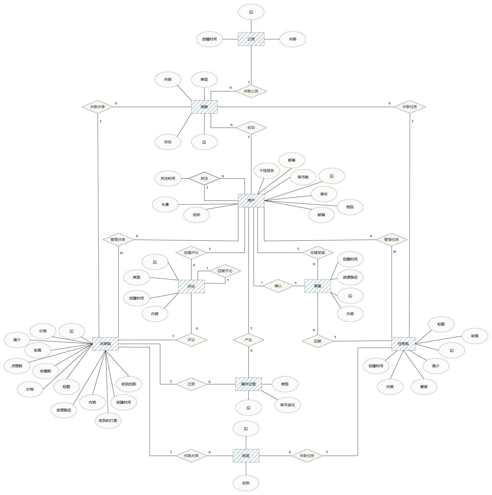
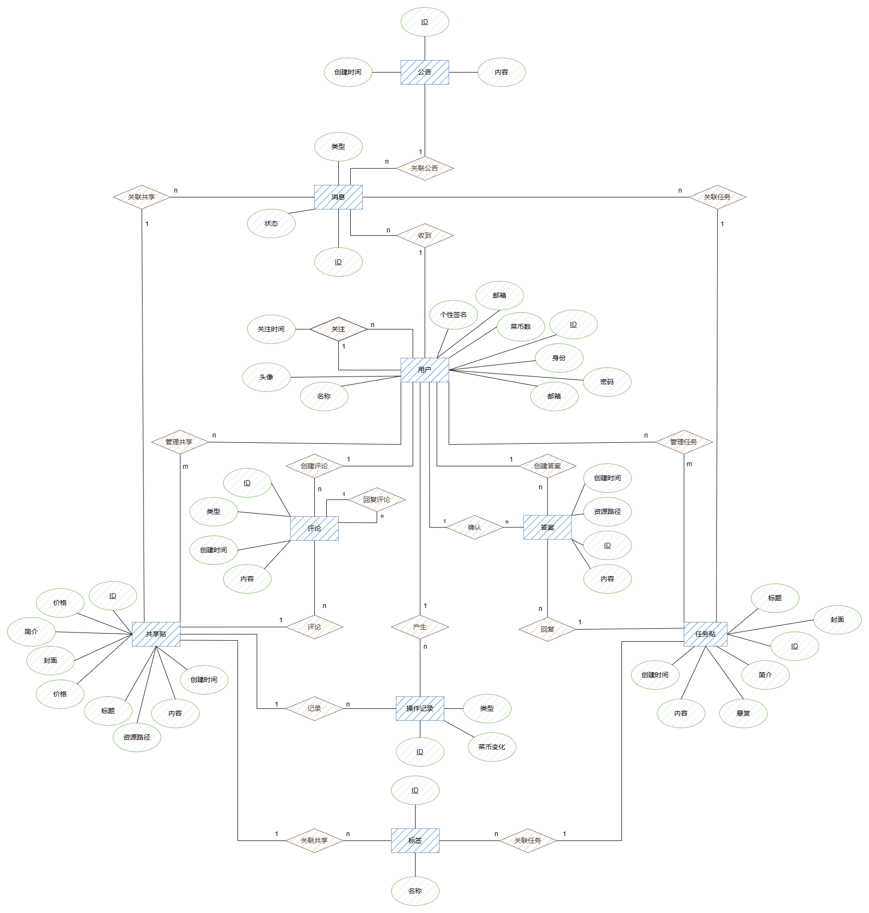
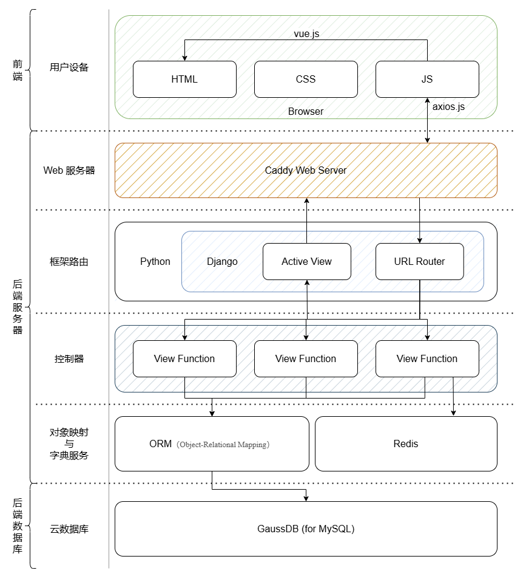

## 数据库概念模式设计

### 系统初步E-R图

### 系统基本E-R图

分析系统初步 E-R 图，我们发现可以消除以下冗余数据：

- 消息中的内容可以通过关联的实体导出，因此不必作为一个单独的属性
- 共享帖里的收藏数、点赞数、打赏数、点踩数可以通过操作记录得出

我们的初步 E-R 图里没有冗余联系，因此得到基本 E-R 图如下，共**九**个实体：

## 系统结构设计

### 体系结构

本项目采用前后端分离的体系结构。前端是静态页面，具体数据通过渲染时请求后端 api 接口得到，并填入到静态插槽中完成渲染。在这个过程中，后端负责根据前端的请求的不同类型、不同接口与不同请求数据，来对数据库进行相应的存取操作并返回处理结果，实现前后端的交互。

#### 前端体系结构

前端基于 vue2，使用 vuetify 作为基本框架进行开发。

前端采用响应式布局，可适配用户的不同设备不同配置。利用 vuex 集中式存储管理应用的所有组件的状态，Vue Router 配置前端路由跳转，避免了繁琐的加载和网页渲染过程，加快前端反应速度、提升用户体验流畅度。使用 GSAP 为前端提供动画支持、vue-particles 呈现背景颗粒，在为用户呈现丝滑的动态场景的同时尽可能减少了设备性能开销。使用 v-md-editor 作为用户界面的编辑器，支持 markdown 语法和实时渲染，方便用户高效快捷的表达自己的想法。

在前后端交互上，项目采用前后端分离的写法，前端通过 axios 组件，根据一定的 api 规范与后端交互，发送和得到后端的数据并在客户端渲染，降低了前后端的耦合度，提升了项目可靠性。

同时，前端项目文件结构清晰，其中

- /src/api 存储进行前后端交互的 api 方法的 JavaScript 文件
- /src/assets 文件夹存储前端需要的静态资源
- /src/components 文件夹存储可复用的 vue 组件
- /src/plugins 文件夹存放 vue 项目的全局插件配置
- /src/router 文件夹存放前端的路由配置
- /src/views 文件夹存放不同页面的布局文件

使用 vue-cli 打包项目，可以在快速开发的同时利用框架自带的功能完成项目文件到部署文件的编译。同时，vue 的性能优化功能可以进一步提升前端性能和适配能力。

综上所述，前端使用 vue2 搭建了一个美观的校园互助平台网页。

#### 前端实现环境

前端依赖如下：

- node 22.7.0
- vue 2.6.14
- vuetify 2.6.0
- axios 1.7.8
- vuex 3.6.2
- vue-router 3.5.1
- register-service-worker 1.7.2
- date-fns 4.1.0
- core-js 3.8.3
- @kangc/v-md-editor 1.7.12
- gsap 3.12.5
- vue-particles 1.0.9

启动方式：在前端项目根目录下

先 `npm install .`

后 `npm run serve`

#### 后端体系结构

后端使用 Caddy 作为 Web 服务器。采用 Django 框架，整体架构基于 Django 的 URL 路由系统，通过接收来自前端的网络请求并根据路由配置将请求分发至不同的视图函数。每个视图函数通过 Django 的 ORM（Object-Relational Mapping）与 GuassDB 数据库进行数据存取操作，确保数据的持久化。对于高频读写数据，本系统使用 Redis 作为缓存层，减少对数据库的直接查询，从而提高性能。处理完业务逻辑后，Django 的模板引擎（Active View）将数据渲染并返回至前端，确保前后端数据交互的高效与灵活。

#### 后端实现环境

- 数据库 GaussDB(for MySQL)
- redis 5:7.0.15-1~deb12u1
- ubuntu 22.04
- django 5.1.2
- python 3.12.2

启动方式：在后端项目根目录下

先 `pip install -r requirements.txt`

后 `python manage.py runserver`

## 总结报告

在这次数据库大作业中，从零开始设计一个前后端分离的网站架构、数据库设计和实现的过程。回顾整个项目，我们不仅在技术能力上获得了显著提升，更在团队协作和项目管理上积累了宝贵的经验。

- 设计API的水平提升
在项目初期，我们小组成员都已经具备了基本的Python编程能力，但对API设计的理解和实践较为薄弱。通过完成项目，我逐步掌握了如何高效设计API。
首先，我学会了如何设计RESTful风格的API，通过合理的路由、请求方式（GET、POST、PUT、DELETE）以及响应的状态码，使得API设计更加规范和易用。在开发过程中，我重视API接口的简洁性与可扩展性，确保前后端能够顺畅对接。
我还了解了API版本控制、参数验证和错误处理的重要性。在数据返回时，我也学会了如何使用标准的JSON格式和自定义响应模型，确保前端可以高效获取和处理数据。
在项目过程中，我还加强了对异步API的理解，学会了如何通过异步支持提升API的性能。这些实践帮助我们逐步提升了API设计的能力，能够更好地满足系统需求。

- Vue.js前端开发能力的提升
在前端部分，我们选择了Vue2框架，尽管之前我们没有太多前端开发经验，但随着项目的推进，我们的Vue.js开发能力有了显著提升。从最基础的页面搭建，到后期的组件化开发，我们逐渐掌握了Vue的核心思想，如指令、生命周期、组件间通信等。
在开发过程中，我们重点学习了Vue的双向数据绑定和响应式设计。通过Vue的v-model、computed和watch，我们能够实现更加动态和灵活的前端交互。此外，我们通过axios与后端接口进行数据交互，优化了前端和后端的协作，熟悉了前端与API的通信方式。
在CSS方面，我们面临着如何在保证功能的前提下使页面变得更加美观的问题。最初，我们在处理页面布局和样式时遇到了困难，尤其是CSS的定位问题。通过多次调整，我们逐渐掌握了CSS的基本技巧，并能够合理运用flexbox和grid布局，使得页面更加简洁、易用。

- 数据库设计与SQL能力的提升
在数据库设计方面，我们从最初的简单ER图和数据流图设计开始，到后期的存储过程和复杂的查询实现，逐步掌握了数据库设计的核心概念。在需求分析阶段，我们通过调研和讨论确定了系统的核心功能，并绘制了详细的ER图和数据流图，确保数据的流畅流通和功能的完备性。

- 团队合作与项目管理的提升
这次项目不仅是我们技术能力的提升，也是团队合作能力的锻炼。从最初的需求讨论，到后期的功能实现和优化，我们小组成员充分发挥各自的优势，分工协作，互相支持。每周的组会和不定期的线上讨论使我们能够快速解决问题，避免了进度的拖延。
在项目的后期，我们的协作能力得到了极大的提升。我们不仅在技术上互相帮助，还在项目管理上相互配合，合理分配任务，确保了项目的顺利进行。

经过这四个月的努力，我们不仅掌握了Python、Vue和数据库方面的技术，还深刻体验到团队合作与项目管理的重要性。通过这次数据库大作业，我们的技术能力得到了大幅提升，尤其是在后端API设计、前端交互和数据库设计上，积累了宝贵的实践经验。这个项目不仅让我们学到了许多技术，更锻炼了我们解决问题的能力，也让我们对前后端开发有了更全面的认识。