[toc]

## 一、系统结构设计

### 1.1 体系结构

本项目采用前后端分离的体系结构。前端是静态页面，具体数据通过渲染时请求后端 api 接口得到，并填入到静态插槽中完成渲染。在这个过程中，后端负责根据前端的请求的不同类型、不同接口与不同请求数据，来对数据库进行相应的存取操作并返回处理结果，实现前后端的交互。


#### 1.1.1 前端体系结构

前端基于 vue2，使用 vuetify 作为基本框架进行开发。

前端采用响应式布局，可适配用户的不同设备不同配置。利用 vuex 集中式存储管理应用的所有组件的状态，Vue Router 配置前端路由跳转，避免了繁琐的加载和网页渲染过程，加快前端反应速度、提升用户体验流畅度。使用 GSAP 为前端提供动画支持、vue-particles 呈现背景颗粒，在为用户呈现丝滑的动态场景的同时尽可能减少了设备性能开销。使用 v-md-editor 作为用户界面的编辑器，支持 markdown 语法和实时渲染，方便用户高效快捷的表达自己的想法。

在前后端交互上，项目采用前后端分离的写法，前端通过 axios 组件，根据一定的 api 规范与后端交互，发送和得到后端的数据并在客户端渲染，降低了前后端的耦合度，提升了项目可靠性。

同时，前端项目文件结构清晰，其中

- /src/api 存储进行前后端交互的 api 方法的 JavaScript 文件
- /src/assets 文件夹存储前端需要的静态资源
- /src/components 文件夹存储可复用的 vue 组件
- /src/plugins 文件夹存放 vue 项目的全局插件配置
- /src/router 文件夹存放前端的路由配置
- /src/views 文件夹存放不同页面的布局文件

使用 vue-cli 打包项目，可以在快速开发的同时利用框架自带的功能完成项目文件到部署文件的编译。同时，vue 的性能优化功能可以进一步提升前端性能和适配能力。

综上所述，前端使用 vue2 搭建了一个美观的校园互助平台网页。

#### 1.1.2 前端实现环境

前端依赖如下：

- node 22.7.0
- vue 2.6.14
- vuetify 2.6.0
- axios 1.7.8
- vuex 3.6.2
- vue-router 3.5.1
- register-service-worker 1.7.2
- date-fns 4.1.0
- core-js 3.8.3
- @kangc/v-md-editor 1.7.12
- gsap 3.12.5
- vue-particles 1.0.9

启动方式：在前端项目根目录下

先 `npm install .`

后 `npm run serve`

#### 1.1.3 后端体系结构

后端使用 Caddy 作为 Web 服务器。采用 Django 框架，整体架构基于 Django 的 URL 路由系统，通过接收来自前端的网络请求并根据路由配置将请求分发至不同的视图函数。每个视图函数通过 Django 的 ORM（Object-Relational Mapping）与 GuassDB 数据库进行数据存取操作，确保数据的持久化。对于高频读写数据，本系统使用 Redis 作为缓存层，减少对数据库的直接查询，从而提高性能。处理完业务逻辑后，Django 的模板引擎（Active View）将数据渲染并返回至前端，确保前后端数据交互的高效与灵活。

#### 1.1.4 后端实现环境

- 数据库 GaussDB(for MySQL)
- redis 5:7.0.15-1~deb12u1
- ubuntu 22.04
- django 5.1.2
- python 3.12.2

启动方式：在后端项目根目录下

先 `pip install -r requirements.txt`

后 `python manage.py runserver`

### 1.2 功能结构

#### 1.2.1 登录注册

用户或者管理员可以在此对账号的状态进行管理。

* 注册：注册新账号，不允许用户名重复。

* 登录：可以通过账号密码进行登录，并可以选择是否保存密码。
* 退出登录：退出登录后会返回登录页面。
* 修改密码：登录后可以在个人中心选择修改密码。

#### 1.2.2 管理员相关功能

管理员可以在此管理公告、用户、分享、悬赏等平台主要的实体，对它们进行**增删改查**的操作。

* 管理公告：**增删改查**公告。
* 管理用户：查看用户、封禁用户、解封用户。
* 管理分享：搜索分享资源、查看分享资源、删除分享资源。
* 管理悬赏：搜索悬赏任务、查看悬赏任务、删除悬赏任务。

#### 1.2.3 共享资源相关功能

用户可以在此**发布**资源、**删除**自己分享的资源、**修改**自己分享的资源、**查询**公共资源。

* 对资源进行筛选：可以依据是否收费、标签（tags）对共享资源进行筛选。
* 对资源进行排序：可以选择 **最推荐**、最多点赞、最多收藏、最近创建、最近评论 对共享资源进行排序。
* 对资源进行搜索：平台支持依据关键词对资源进行模糊搜索。
* 购买付费资源。
* 查看资源：查看资源点赞数量、收藏数量、评论数量、点踩数量；查看资源介绍以及标签。
* 查看某资源的评论。
* 下载资源：用户可以通过北航云盘下载免费资源或者已经购买了的资源。
* 获取自己分享的所有资源。
* 修改编辑自己分享的资源。
* 删除自己分享的资源。
* 分享新资源：用户可以自由地分享资源，并设定标题、收费金额、标签、描述等关键信息。

#### 1.2.4 任务悬赏相关功能

用户可以在此**发布**悬赏任务、**关闭**自己发布的悬赏任务、**修改**自己发布的悬赏任务、**查询**他人发布的悬赏任务。

* 对悬赏进行筛选：可以依据标签（tags）对任务悬赏进行筛选。
* 对悬赏进行排序：可以选择 **最推荐**、悬赏金额、最近创建、最近回答 对任务悬赏进行筛选。
* 对悬赏进行搜索：平台支持依据关键词对悬赏进行模糊搜索。
* 查看悬赏内容：查看悬赏的题目、状态（一般为进行中）、标签、发布时间、悬赏需求。
* 解答悬赏任务：对某个特定的悬赏上传特定的资源。
* 获取自己发布的所有悬赏任务。
* 发布新悬赏：用户可以发布新的悬赏任务，并设定标题、报酬、标签、悬赏需求等关键信息。
* 下载解答者提供的资源：某悬赏的发布者可以下载解答者上传的资源，其他用户则无法看到该资源。
* 关闭悬赏：某悬赏的发布者可以选择某一个解答者上传的资源作为最佳答案，并将报酬支付给该解答者，以关闭该悬赏。

#### 1.2.5 用户个人信息相关功能

用户可以在这里**增加**个人信息、**删除**自己之前上传的可删除的信息、**修改**自己的个人信息、**查询**与自己相关的信息。

* 查看公告：用户可以看到管理员发布的公告。
* 查看或修改个人基本信息：修改密码、查看或修改电子邮件地址、查看或修改个性标签、查看修改头像。
* 查看个人数据：查看菜币数量、查看获赞数量、查看发帖次数、查看回答次数、查看粉丝数量。
* 关注/取消关注其他用户。
* 收藏/取消收藏其他用户。
* 打开/关闭黑暗模式，打开/关闭背景颗粒。

---

## 二、数据库基本表的定义

> 本项目所用数据库均设计为BCNF，旨在消除任何形式的冗余和异常，确保数据的一致性和完整性。我们保证了所有非主属性完全函数依赖于候选键，并且每一个决定因素都是超键，从而避免了更新、插入和删除操作中可能出现的异常情况。在设计过程中，我们对每个关系模式进行了细致分析，确保满足BCNF的要求，同时考虑到实际应用中的查询效率和维护成本，对某些表结构进行了合理的调整，以求在理论规范和实际性能之间取得平衡。

### 2.1 用户表（Users）

| 字段名称      | 类型         | 备注                                         |
| ------------- | ------------ | -------------------------------------------- |
| <u>UserId</u> | INT          | PK，用户创建时唯一指定                       |
| Name          | VARCHAR(50)  | 昵称                                         |
| Email         | VARCHAR(100) | 邮箱                                         |
| Keyword       | VARCHAR(50)  | 密码，建议前端对格式做限定                   |
| Status        | VARCHAR(50)  | 仅有三种值：User、Administrator、Root        |
| Avatar        | VARCHAR(255) | 头像路径                                     |
| Profile       | VARCHAR(200) | 个人简介                                     |
| Coin          | INT          | 菜币数量                                     |
| Color         | BOOLEAN      | 0：黑暗模式、1：背景颗粒                     |
| Token         | VARCHAR(200) | 没想好鉴权模式，感觉直接放数据库里也不是不行 |

### 2.2 基础消息表（Messages）

| 字段名称         | 类型        | 备注                                                   |
| ---------------- | ----------- | ------------------------------------------------------ |
| <u>MessageId</u> | INT         | PK，消息创建时唯一指定                                 |
| *UserId*         | INT         | FK，关联到Users，消息展示给的用户                      |
| Type             | VARCHAR(50) | 仅有五种值：Notice、Comment、Reply、Answer、Reward[^1] |
| Read             | BOOLEAN     | 0：未读、1：已读                                       |

### 2.3 公告消息表（NoticeMessages）

| 字段名称         | 类型 | 备注                                      |
| ---------------- | ---- | ----------------------------------------- |
| <u>MessageId</u> | INT  | PK，FK，关联到BaseMessages.MessageId      |
| *NoticeId*       | INT  | FK，关联到Notices，仅当Type为Notice时有效 |

### 2.4 共享消息表（ShareMessages）

| 字段名称         | 类型 | 备注                                             |
| ---------------- | ---- | ------------------------------------------------ |
| <u>MessageId</u> | INT  | PK，FK，关联到BaseMessages.MessageId             |
| *ShareId*        | INT  | FK，关联到Shares，仅当Type为Comment或Reply时有效 |

### 2.5 互助消息表（RewardMessages）

| 字段名称         | 类型 | 备注                                              |
| ---------------- | ---- | ------------------------------------------------- |
| <u>MessageId</u> | INT  | PK，FK，关联到BaseMessages.MessageId              |
| *RewardId*       | INT  | FK，关联到Rewards，仅当Type为Answer或Reward时有效 |

[^1]: Notice：公告更新通知，Comment：评论通知，Reply：回复通知，Answer：收到回复通知，Reward：收获打赏通知

### 2.6 关注表（Follows）

| 字段名称        | 类型     | 备注                        |
| --------------- | -------- | --------------------------- |
| <u>FollowId</u> | INT      | PK，关注时唯一指定          |
| *FromId*        | INT      | FK，关联到Users，关注者id   |
| *ToId*          | INT      | FK，关联到Users，被关注者id |
| Data            | DATETIME | 关注时间                    |

### 2.7 公告表（Notices）

| 字段名称        | 类型     | 备注                   |
| --------------- | -------- | ---------------------- |
| <u>NoticeId</u> | INT      | PK，公告创建时唯一指定 |
| Text            | TEXT     | 公告内容               |
| Data            | DATETIME | 创建时间               |

### 2.8 标签表（Tags）

| 字段名称     | 类型        | 备注                   |
| ------------ | ----------- | ---------------------- |
| <u>TagId</u> | INT         | PK，标签创建时唯一指定 |
| Name         | VARCHAR(50) | 标签名                 |

### 2.9 共享表（Shares）

| 字段名称       | 类型         | 备注                      |
| -------------- | ------------ | ------------------------- |
| <u>ShareId</u> | INT          | PK，创建分享时唯一指定    |
| Headline       | VARCHAR(50)  | 标题                      |
| Price          | INT          | 价格，免费则为0           |
| *CreatorId*    | INT          | FK，关联到Users，创建者id |
| Text           | TEXT         | 文章内容                  |
| Cover          | VARCHAR(255) | 封面路径                  |
| Profile        | VARCHAR(200) | 简介                      |
| ResourceLink   | VARCHAR(255) | 资源路径                  |
| Like           | INT          | 点赞数量                  |
| Dislike        | INT          | 点踩数量                  |
| Coin           | INT          | 菜币数量                  |
| Favourite      | INT          | 收藏数量                  |
| Data           | DATETIME     | 创建时间                  |

### 2.10 共享标签表（ShareTags）

| 字段名称          | 类型 | 备注                           |
| ----------------- | ---- | ------------------------------ |
| <u>ShareTagId</u> | INT  | PK，创建共享帖子标签时唯一指定 |
| *ShareId*         | INT  | FK，关联到Shares，帖子id       |
| *CreatorId*       | INT  | FK，关联到Users，创建者id      |
| *TagId*           | INT  | FK，关联到Tags，标签id         |

### 2.11 共享操作表（ShareOperators）

| 字段名称               | 类型        | 备注                                                      |
| ---------------------- | ----------- | --------------------------------------------------------- |
| <u>ShareOperatorId</u> | INT         | PK，进行操作时唯一指定                                    |
| *ShareId*              | INT         | FK，关联到Shares                                          |
| *UserId*               | INT         | FK，关联到Users                                           |
| Type                   | VARCHAR(50) | 只能有5种值：Purchase、Like、Dislike、Coin、Favourite[^2] |
| Coin                   | INT         | 投币数量，仅Type为Coin时有效                              |
| Data                   | DATETIME    | 操作时间                                                  |

[^2]: Purchase购买，Like点赞，Dislike点踩，Coin投币，Favourite收藏

### 2.12 共享评论表（Comments）

| 字段名称         | 类型        | 备注                                                      |
| ---------------- | ----------- | --------------------------------------------------------- |
| <u>CommentId</u> | INT         | PK，创建评论时唯一指定                                    |
| Type             | VARCHAR(50) | 仅有两种值：Comment，Reply（回复帖子、回复回复）          |
| *ShareId*        | INT         | FK，关联到Shares，帖子id                                  |
| *ReplyId*        | INT         | FK，关联到Comments，被回复的评论id，仅当Type为Reply时有效 |
| Text             | TEXT        | 回复正文                                                  |
| Data             | DATETIME    | 创建时间                                                  |

### 2.13 评论操作表（CommentOperators）

| 字段名称                 | 类型        | 备注                       |
| ------------------------ | ----------- | -------------------------- |
| <u>CommentOperatorId</u> | INT         | PK，进行操作时唯一指定     |
| *CommentId*              | INT         | FK，关联到Shares           |
| *UserId*                 | INT         | FK，关联到Users            |
| Type                     | VARCHAR(50) | 只能有2种值：Like、Dislike |
| Data                     | DATETIME    | 操作时间                   |

### 2.14 互助表（Rewards）

| 字段名称        | 类型         | 备注                                 |
| --------------- | ------------ | ------------------------------------ |
| <u>RewardId</u> | INT          | PK，创建互助贴时唯一指定             |
| Headline        | VARCHAR(50)  | 标题                                 |
| Reward          | INT          | 悬赏金额                             |
| *CreatorId*     | INT          | FK，关联到Users，创建者id            |
| Text            | TEXT         | 文章内容                             |
| Cover           | VARCHAR(255) | 封面路径                             |
| Profile         | VARCHAR(200) | 简介                                 |
| Data            | DATETIME     | 创建时间                             |
| Coin            | INT          | 收获菜币数目，仅当Type为Reward时有效 |

### 2.15 互助标签表（RewardTags）

| 字段名称           | 类型 | 备注                           |
| ------------------ | ---- | ------------------------------ |
| <u>RewardTagId</u> | INT  | PK，创建互助帖子标签时唯一指定 |
| *RewardId*         | INT  | FK，关联到Shares，帖子id       |
| *TagId*            | INT  | FK，关联到Tags，标签id         |

### 2.16 互助评论表（Answers）

| 字段名称        | 类型         | 备注                          |
| --------------- | ------------ | ----------------------------- |
| <u>AnswerId</u> | INT          | PK，互助评论创建时唯一指定    |
| *RewardId*      | INT          | FK，关联到Rewards，共享标签id |
| CreatorId       | INT          | FK，关联到Users，创建者id     |
| Text            | TEXT         | 回复内容                      |
| ResourceLink    | VARCHAR(255) | 资源路径                      |
| Data            | DATETIME     | 评论时间                      |

---
## 三、系统重要功能实现方法

### 3.1 模型设计

> 本项目使用Django ORM进行代码中数据和数据库中属性的存储、查询。Django ORM（对象关系映射）是Django框架的一部分，它允许开发者使用Python代码来与数据库进行交互，而不需要编写SQL语句。ORM在对象导向编程语言和关系型数据库之间架起了一座桥梁，使得操作数据库就像操作普通的Python对象一样简单。

#### 3.1.1 用户模型 (Users)

- 对`UserId`字段建立存在性约束和唯一性约束。
- 对`Name`字段建立存在性约束和长度约束（最小长度：1 bytes，最大长度：50 bytes）。
- 对`Email`字段建立存在性约束、长度约束（最小长度：1 bytes，最大长度：100 bytes）、格式约束（必须符合该正则表达式形式：*@*）和唯一性约束。
- 对`Keyword`字段建立存在性约束和长度约束（最小长度：建议前端对格式做限定，未明确指定最小长度，最大长度：50 bytes）。
- 对`Status`字段建立存在性约束和范围约束（只可取 "User"，"Administrator"，"Root"）。
- 对`Avatar`字段建立长度约束（最大长度：255 bytes）。
- 对`Profile`字段建立长度约束（最大长度：200 bytes）。
- 对`Coin`字段建立存在性约束。
- 对`Color`字段建立存在性约束和范围约束（只可取 0 或 1）。
- 对`Token`字段建立长度约束（最大长度：200 bytes）。

```python
class Users(models.Model):
    userId = models.AutoField(primary_key=True, verbose_name="User ID")
    name = models.CharField(max_length=50, verbose_name="Name")
    email = models.CharField(max_length=100, verbose_name="Email", null=True, blank=True)
    password = models.CharField(max_length=50, verbose_name="Password")
    status = models.CharField(max_length=50, choices=(
        ('User', 'User'),
        ('Administrator', 'Administrator'),
        ('Root', 'Root')
    ), default='User', verbose_name="Status")
    avatar = models.ImageField(upload_to='static/img/', default='static/img/default.jpg')
    profile = models.CharField(max_length=200, blank=True, null=True, verbose_name="Profile")
    coin = models.IntegerField(default=0, verbose_name="Coin Quantity")
    color = models.BooleanField(default=False, verbose_name="Color Preference (0: Dark Mode, 1: Background Grain)")
    token = models.CharField(max_length=500, blank=True, null=True, verbose_name="Token")
    block = models.BooleanField(default=False, verbose_name="Block")
    date = models.DateTimeField(auto_now_add=True)
```

#### 3.1.2 基础消息模型 (Messages)

- 对`MessageId`字段建立存在性约束和唯一性约束。
- 对`UserId`字段建立存在性约束，并作为外键关联到`Users`表。
- 对`Type`字段建立存在性约束和范围约束（只可取 "Notice"，"Comment"，"Reply"，"Answer"，"Reward"）。
- 对`Read`字段建立存在性约束和范围约束（只可取 0 或 1）。

```python
class Messages(models.Model):
    messageId = models.IntegerField(primary_key=True, verbose_name='消息ID')
    userId = models.IntegerField(verbose_name='用户ID', db_column='UserId')
    type = models.CharField(max_length=50,
                            choices=[('Notice', '公告'), ('Comment', '评论'), ('Reply', '回复'), ('Answer', '回答'),
                                     ('Reward', '奖励')], verbose_name='类型')
    read = models.BooleanField(default=False, verbose_name='是否已读')
```

#### 3.1.3 公告消息模型 (NoticeMessages)

- 对`MessageId`字段建立存在性约束、唯一性约束，并作为外键关联到`Messages`表。
- 对`NoticeId`字段建立存在性约束，并作为外键关联到`Notices`表。

```python
class NoticeMessages(models.Model):
    messageId = models.IntegerField(default=0)
    noticeId = models.IntegerField(null=True, blank=True, verbose_name='公告ID')
```

#### 3.1.4 共享消息模型 (ShareMessages)

- 对`MessageId`字段建立存在性约束、唯一性约束，并作为外键关联到`Messages`表。
- 对`ShareId`字段建立存在性约束，并作为外键关联到`Shares`表。

```python
class ShareMessages(models.Model):
    messageId = models.IntegerField(default=0)
    shareId = models.IntegerField(null=True, blank=True, verbose_name='分享ID')
```

#### 3.1.5 互助消息模型 (RewardMessages)

- 对`MessageId`字段建立存在性约束、唯一性约束，并作为外键关联到`Messages`表。
- 对`RewardId`字段建立存在性约束，并作为外键关联到`Rewards`表。

```python
class RewardMessages(models.Model):
    messageId = models.IntegerField(default=0)
    rewardId = models.IntegerField(null=True, blank=True, verbose_name='分享ID')
```

#### 3.1.6 关注模型 (Follows)

- 对`FollowId`字段建立存在性约束和唯一性约束。
- 对`FromId`字段建立存在性约束，并作为外键关联到`Users`表。
- 对`ToId`字段建立存在性约束，并作为外键关联到`Users`表。

```python
class Follows(models.Model):
    followId = models.AutoField(primary_key=True)  # PK, 关注时唯一指定
    fromId = models.IntegerField(default=0)  # FK, 关联到 Users, 关注者的 id
    toId = models.IntegerField(default=0)  # FK, 关联到 Users, 被关注者的 id
    date = models.DateTimeField(auto_now_add=True)  # 关注时间
```

#### 3.1.7 公告模型 (Notices)

- 对`NoticeId`字段建立存在性约束和唯一性约束。
- 对`Text`字段建立存在性约束。
- 对`Data`字段建立存在性约束。

```python
class Notices(models.Model):
    noticeId = models.AutoField(primary_key=True)  # PK, 公告创建时唯一指定
    title = models.CharField(max_length=50)
    text = models.TextField()  # 公告内容
    date = models.DateTimeField(auto_now_add=True)  # 创建时间
    url = models.CharField(max_length=255, blank=True, null=True, verbose_name="URL")
```

#### 3.1.8 标签模型 (Tags)

- 对`TagId`字段建立存在性约束和唯一性约束。
- 对`Name`字段建立存在性约束和长度约束（最大长度：50 bytes）。

```python
class Tags(models.Model):
    tagId = models.AutoField(primary_key=True)  # PK, 标签创建时唯一指定
    name = models.CharField(max_length=50)  # 标签名
```

#### 3.1.9 共享模型 (Shares)

- 对`ShareId`字段建立存在性约束和唯一性约束。
- 对`Headline`字段建立存在性约束和长度约束（最大长度：50 bytes）。
- 对`Price`字段建立存在性约束。
- 对`CreatorId`字段建立存在性约束，并作为外键关联到`Users`表。
- 对`Text`字段建立存在性约束。
- 对`Cover`字段建立长度约束（最大长度：255 bytes）。
- 对`Profile`字段建立长度约束（最大长度：200 bytes）。
- 对`ResourceLink`字段建立长度约束（最大长度：255 bytes）。
- 对`Like`字段建立存在性约束。
- 对`Dislike`字段建立存在性约束。
- 对`Coin`字段建立存在性约束。
- 对`Favourite`字段建立存在性约束。
- 对`Data`字段建立存在性约束。

```python
class Shares(models.Model):
    shareId = models.AutoField(primary_key=True)  # 分享ID，自增长
    headline = models.CharField(max_length=50)  # 标题
    price = models.IntegerField(default=0)  # 价格，默认为0
    creatorId = models.IntegerField(default=0)  # 创建者id，外键关联到用户表
    text = models.TextField()  # 文章内容
    cover = models.CharField(max_length=255)  # 封面路径
    profile = models.CharField(max_length=200)  # 简介
    resourceLink = models.CharField(max_length=255)  # 资源路径
    like = models.IntegerField(default=0)  # 点赞数量，默认为0
    dislike = models.IntegerField(default=0)  # 点踩数量，默认为0
    coin = models.IntegerField(default=0)  # 菜币数量，默认为0 # 目前api已经无用
    favourite = models.IntegerField(default=0)  # 收藏数量，默认为0
    date = models.DateTimeField(auto_now_add=True)
    bhpanUrl = models.CharField(max_length=255, blank=True, null=True, verbose_name="BHPAN URL")
    url = models.CharField(max_length=255, blank=True, null=True, verbose_name="URL")
```

#### 3.1.10 共享标签模型 (ShareTags)

- 对`ShareTagId`字段建立存在性约束和唯一性约束。
- 对`ShareId`字段建立存在性约束，并作为外键关联到`Shares`表。
- 对`TagId`字段建立存在性约束，并作为外键关联到`Tags`表。

```python
class ShareTags(models.Model):
    shareTagId = models.AutoField(primary_key=True)  # PK, 创建共享帖子时唯一指定
    shareId = models.IntegerField(default=0)  # FK，关联到 Shares，帖子 id
    creatorId = models.IntegerField(default=0)  # FK, 关联到 Users, 创建者 id
    tagId = models.IntegerField(default=0)  # FK, 关联到 Tags, 标签 id
```

#### 3.1.11 共享操作模型 (ShareOperators)

- 对`ShareOperatorId`字段建立存在性约束和唯一性约束。
- 对`ShareId`字段建立存在性约束，并作为外键关联到`Shares`表。
- 对`UserId`字段建立存在性约束，并作为外键关联到`Users`表。
- 对`Type`字段建立存在性约束和范围约束（只可取 "Purchase"，"Like"，"Dislike"，"Coin"，"Favourite"）。
- 对`Coin`字段建立存在性约束，仅当`Type`为 "Coin" 时有效。

```python
class ShareOperators(models.Model):
    operatorId = models.AutoField(primary_key=True)  # PK, 进行操作时唯一指定
    shareId = models.IntegerField(default=0)  # FK, 关联到 Shares
    userId = models.IntegerField(default=0)  # FK, 关联到 Users
    type = models.CharField(max_length=50,
                            choices=[('Purchase', '购买'), ('Like', '点赞'), ('Dislike', '点踩'), ('Coin', '投币'),
                                     ('Favourite', '收藏')])
    coin = models.IntegerField(null=True, blank=True)  # 投币数量，仅 Type 为 Coin 时有效
    date = models.DateTimeField(auto_now_add=True)  # 操作时间
```

#### 3.1.12 共享评论模型 (Comments)

- 对`CommentId`字段建立存在性约束和唯一性约束。
- 对`Type`字段建立存在性约束和范围约束（只可取 "Comment"，"Reply"）。
- 对`ShareId`字段建立存在性约束，并作为外键关联到`Shares`表。
- 对`ReplyId`字段建立存在性约束，并作为外键关联到`Comments`表，仅当`Type`为 "Reply" 时有效。
- 对`Text`字段建立存在性约束。
- 对`Data`字段建立存在性约束。

```python
class Comments(models.Model):
    commentId = models.AutoField(primary_key=True)
    type = models.CharField(max_length=50, choices=[('Comment', '回复帖子'), ('Reply', '回复回复')],
                            verbose_name='仅有两种值：Comment，Reply（回复帖子、回复回复）')
    shareId = models.IntegerField(default=0)
    replyId = models.IntegerField(default=0) # Comment
    creatorId = models.IntegerField(default=0)
    text = models.TextField(verbose_name='回复正文')
    date = models.DateTimeField(auto_now_add=True, verbose_name='创建时间')
```

#### 3.1.13 评论操作模型 (CommentOperators)

- 对`CommentOperatorId`字段建立存在性约束和唯一性约束。
- 对`CommentId`字段建立存在性约束，并作为外键关联到`Comments`表。
- 对`UserId`字段建立存在性约束，并作为外键关联到`Users`表。
- 对`Type`字段建立存在性约束和范围约束（只可取 "Like"，"Dislike"）。

```python
class CommentOperators(models.Model):
    commentOperatorId = models.AutoField(primary_key=True)
    commentId = models.IntegerField(default=0)
    userId = models.IntegerField(default=0)
    type = models.CharField(max_length=50, choices=[('Like', 'Like'), ('Dislike', 'Dislike')])
    date = models.DateTimeField(auto_now_add=True)
```

#### 3.1.14 互助模型 (Rewards)

- 对`RewardId`字段建立存在性约束和唯一性约束。
- 对`Headline`字段建立存在性约束和长度约束（最大长度：50 bytes）。
- 对`Reward`字段建立存在性约束。
- 对`CreatorId`字段建立存在性约束，并作为外键关联到`Users`表。
- 对`Text`字段建立存在性约束。
- 对`Cover`字段建立长度约束（最大长度：255 bytes）。
- 对`Profile`字段建立长度约束（最大长度：200 bytes）。
- 对`Data`字段建立存在性约束。
- 对`Coin`字段建立存在性约束，仅当`Type`为 "Reward" 时有效。

```python
class Rewards(models.Model):
    rewardId = models.AutoField(primary_key=True)  # PK, 创建互助贴时唯一指定
    headline = models.CharField(max_length=50)  # 标题
    reward = models.IntegerField()  # 悬赏金额
    creatorId = models.IntegerField(default=0)  # FK, 关联到 Users, 创建者 id
    text = models.TextField()  # 文章内容
    cover = models.CharField(max_length=255)  # 封面路径
    profile = models.CharField(max_length=200)  # 简介
    date = models.DateTimeField(auto_now_add=True)  # 创建时间
    close = models.BooleanField(default=False, verbose_name='是否关闭')
    answerId = models.IntegerField(default=0) # 最终答案
    url = models.CharField(max_length=255, blank=True, null=True, verbose_name="URL")
```

#### 3.1.15 互助标签模型 (RewardTags)

- 对`RewardTagId`字段建立存在性约束和唯一性约束。
- 对`RewardId`字段建立存在性约束，并作为外键关联到`Rewards`表。
- 对`TagId`字段建立存在性约束，并作为外键关联到`Tags`表。

```python
class RewardTags(models.Model):
    rewardTagId = models.AutoField(primary_key=True)  # PK, 创建互助帖子标签时唯一指定
    rewardId = models.IntegerField(default=0)  # FK, 关联到 Rewards, 帖子 id
    tagId = models.IntegerField(default=0)  # FK, 关联到 Tags, 标签 id
```

#### 3.1.16 互助答案模型 (Answers)

- 对`AnswerId`字段建立存在性约束和唯一性约束。
- 对`RewardId`字段建立存在性约束，并作为外键关联到`Rewards`表。
- 对`CreatorId`字段建立存在性约束，并作为外键关联到`Users`表。
- 对`Text`字段建立存在性约束。
- 对`ResourceLink`字段建立长度约束（最大长度：255 bytes）。
- 对`Data`字段建立存在性约束。

```python
class Answers(models.Model):
    answerId = models.AutoField(primary_key=True)  # PK, 互助评论创建时唯一指定
    rewardId = models.IntegerField(default=0)  # FK, 关联到 Rewards, 共享标签 id
    creatorId = models.IntegerField(default=0)  # FK, 关联到 Users, 创建者 id
    text = models.TextField()  # 回复正文
    resource_link = models.CharField(max_length=255)  # 资源链接
    date = models.DateTimeField(auto_now_add=True)  # 评论时间
```

#### 3.1.17 公告标签模型 (NoticeTags)

- 对`noticeTagId`字段建立存在性约束和唯一性约束。
- 对`noticeId`字段建立存在性约束，并作为外键关联到`Notices`表。
- 对`tagId`字段建立存在性约束，并作为外键关联到`Tags`表。

```python
class NoticeTags(models.Model):
    noticeTagId = models.AutoField(primary_key=True)  # PK, 创建公告时唯一指定
    noticeId = models.IntegerField(default=0)  # FK，关联到 Notices，帖子 id
    tagId = models.IntegerField(default=0)  # FK, 关联到 Tags, 标签 id
```

### 3.2  存储过程设计与实现说明

#### 3.2.1 注册登录模块

##### 根路由

/user

如果已经登录则不应该响应这些请求。

##### 用户注册

- 路径 /register
- 方法 POST
- 路径参数 无
- 查询参数 无
- 请求体 表单数据

|   字段名   |  类型  | 可选 | 解释 | 备注 |
| :--------: | :----: | :--: | :--: | :--: |
|  username  | string |  -   |  -   |  -   |
|  password  | string |  -   |  -   |  -   |
|   email    | string |  -   |  -   |  -   |
| student_id | string |  -   | 学号 |  -   |
| real_name  | string |  -   | 实名 |  -   |

- 成功响应 无

```python
class UserRegistrationView(View):
    @staticmethod
    def post(request):
        data = request.POST
        username = data.get('username')
        password = data.get('password')
        email = data.get('email')
        real_name = data.get('real_name')

        if Users.objects.filter(name=username).exists():
            return JsonResponse(gen_failed_template(201))

        try:
            new_user = Users(
                name=username,
                password=password,
                email=email,
            )
            new_user.save()
            return JsonResponse(gen_success_template())
        except Exception as e:
            print(e)
            return JsonResponse(gen_failed_template(206))
```

##### 用户密码登录

- 路径 /login
- 方法 POST
- 路径参数 无
- 查询参数 无
- 请求体 表单数据

|  字段名  |  类型  |   可选   | 解释 |              备注              |
| :------: | :----: | :------: | :--: | :----------------------------: |
| username | string | &#10004; |  -   | username 和 email 必须选择一个 |
| password | string |    -     |  -   |               -                |
|  email   | string | &#10004; |  -   | username 和 email 必须选择一个 |

- 成功响应

| 字段名  | 类型 |    解释    |                    备注                    |
| :------ | :--: | :--------: | :----------------------------------------: |
| role    | int  | 用户的身份 | 暂定只有 USER 和 ADMIN 两种，分别为 0 和 1 |
| user_id | uuid |  用户 id   |                     -                      |

```python
class UserLoginView(View):
    @staticmethod
    def post(request):
        data = request.POST
        username = data.get('username')
        password = data.get('password')
        email = data.get('email')
        if username is None and password is None:
            return JsonResponse(gen_failed_template(210))
        if username is not None:
            if Users.objects.filter(name=username).exists():
                user = Users.objects.get(name=username)
                if user.password == password:
                    if user.block:
                        return JsonResponse(gen_failed_template(209))
                    else:
                        token = generate_token(user)
                        ret_data = {
                            "role": user.status,
                            "user_id": user.userId,
                        }
                        res = JsonResponse(gen_success_template(data=ret_data))
                        res.set_cookie('session', token)
                        user.token = token
                        user.save()
                        return res
                else:
                    return JsonResponse(gen_failed_template(208))
            else:
                return JsonResponse(gen_failed_template(207))
        else:
            if Users.objects.filter(email=email).exists():
                user = Users.objects.get(email=email)
                if user.password == password:
                    if user.block:
                        return JsonResponse(gen_failed_template(209))
                    else:
                        token = generate_token(user)
                        ret_data = {
                            "role": user.status,
                            "user_id": user.userId,
                        }
                        res = JsonResponse(gen_success_template(data=ret_data))
                        res.set_cookie('session', token)
                        user.token = token
                        user.save()
                        return res
                else:
                    return JsonResponse(gen_failed_template(208))
            else:
                return JsonResponse(gen_failed_template(207))
```

#### 3.2.2 通知模块

##### 根路由

/notification

|  通知类型  | 对应编号 |
| :--------: | :------: |
|    公告    |    0     |
| 帖子的评论 |    1     |
| 评论的回复 |    2     |
|    打赏    |    3     |

##### 获取未读通知

- 路径 /unread
- 方法 GET
- 路径参数 无
- 查询参数

| 字段名 | 类型 |   可选   |        解释        |   备注    |
| :----: | :--: | :------: | :----------------: | :-------: |
| depth  | int  | &#10004; | 最多获取的通知个数 | 默认为 99 |

- 请求体 无
- 成功响应

| 字段名                       |                    类型                    |              解释              |                  备注                  |
| :--------------------------- | :----------------------------------------: | :----------------------------: | :------------------------------------: |
| not_read                     |                    int                     |          未读通知个数          |                   -                    |
| messages                     |                 [:message]                 |               -                |     该字段下最多 depth 个 message      |
| messages:message             | {:id, :type, :content, :url, :notified_at} |               -                |                   -                    |
| messages:message:id          |                    uuid                    |            通知 id             |                   -                    |
| messages:message:type        |                    int                     |            通知类型            |                   -                    |
| messages:message:content     |                   string                   |         通知的内容缩写         | 固定 30 个字符，超出的部分用省略号代替 |
| messages:message:url         |                   string                   | 通知的所在网址，比如帖子的地址 |                   -                    |
| messages:message:notified_at |                  datetime                  |            通知时间            |                   -                    |

```python
class NotificationUnreadView(View):
    def get(self, request):
        token = request.COOKIES.get('session')
        auth, user = user_authenticate(token)
        if not auth:
            return gen_failed_template(212)

        depth = int(request.GET.get('depth', '99'))
        tmp_ids = MessageUsers.objects.filter(userId=user.userId).values_list('messageId', flat=True)
        messages = Messages.objects.filter(messageId__in=tmp_ids, read=False)

        not_read = len(messages)
        list = []
        for message in messages[:depth]:
            if message.type == 0:
                notice = Notices.objects.get(message.noticeId)
                list.append({"message": {
                    "id": message.messageId,
                    "type": message.type,
                    "content": notice.text,
                    "url": notice.url,
                    "notified": notice.date
                }})
            elif message.type in [1, 2]:
                share = Shares.objects.get(message.shareId)
                list.append({"message": {
                    "id": message.messageId,
                    "type": message.type,
                    "content": share.text,
                    "url": share.url,
                    "notified": share.date
                }})
            elif message.type in [3, 4]:
                reward = Rewards.objects.get(message.rewardId)
                list.append({"message": {
                    "id": message.messageId,
                    "type": message.type,
                    "content": reward.text,
                    "url": reward.url,
                    "notified": reward.date
                }})
        ret_data = {
            "not_read": not_read,
            "messages": list,
        }
        return JsonResponse(gen_success_template(data=ret_data))
```

##### 搜索通知

- 路径 /search
- 方法 GET
- 路径参数 无
- 查询参数

|  字段名  |  类型  |   可选   |                 解释                 |       备注       |
| :------: | :----: | :------: | :----------------------------------: | :--------------: |
| key_word | string | &#10004; |                关键词                |  为空则搜索全部  |
|  status  |  bool  | &#10004; |           已读 1 或未读 0            |  为空则搜索全部  |
|   type   | [int]  | &#10004; | 可选任意多个通知类型，类型见“根路由” |  为空则搜索全部  |
|   page   |  int   | &#10004; |                第几页                | 为空则返回第一页 |
| per_page |  int   | &#10004; |             每页显示几个             | 为空则显示 15 个 |

- 请求体 无
- 成功响应

| 字段名                       |                        类型                         |              解释              |               备注               |
| :--------------------------- | :-------------------------------------------------: | :----------------------------: | :------------------------------: |
| total                        |                         int                         |               -                |                -                 |
| total_page                   |                         int                         |               -                |                -                 |
| page                         |                         int                         |               -                |                -                 |
| per_page                     |                         int                         |               -                |                -                 |
| messages                     |                     [:message]                      |         未读消息的简报         | 该字段下最多 per_page 个 message |
| messages:message             | {:id, :type, :status, :content, :url, :notified_at} |               -                |                -                 |
| messages:message:id          |                        uuid                         |            通知 id             |                -                 |
| messages:message:type        |                         int                         |            通知类型            |                -                 |
| messages:message:status      |                        bool                         |        已读 1 或未读 0         |                -                 |
| messages:message:content     |                       string                        |         通知的内容缩写         |                -                 |
| messages:message:url         |                       string                        | 通知的所在网址，比如帖子的地址 |                -                 |
| messages:message:notified_at |                      datetime                       |            通知时间            |                -                 |

```python
class NotificationSearchView(View):
    def get(self, request):
        token = request.COOKIES.get('session')
        auth, user = user_authenticate(token)
        if not auth:
            return gen_failed_template(212)

        if "key_word" in request.GET:
            try:
                tag = Tags.objects.get(name=request.GET["key_word"])
            except Tags.DoesNotExist:
                return gen_failed_template(701)
            tagIds = [tag.tagId]
        else:
            tagIds = [tag.tagId for tag in Tags.objects.all()]

        tmp_ids = MessageUsers.objects.filter(userId=user.userId).values_list('messageId', flat=True)
        messages = Messages.objects.filter(messageId__in=tmp_ids, read=False)
        tmp_messages = []
        for message in messages:
            if message.type == 0:
                notice = Notices.objects.get(message.noticeId)
                for noticeTag in NoticeTags.objects.all():
                    if noticeTag.noticeId == notice.noticeId and noticeTag.tagId in tagIds:
                        tmp_messages.append(message)
            elif message.type in [1, 2]:
                share = Shares.objects.get(message.shareId)
                for shareTag in ShareTags.objects.all():
                    if shareTag.shareId == share.shareId and shareTag.tagId in tagIds:
                        tmp_messages.append(message)
            elif message.type in [3, 4]:
                reward = Rewards.objects.get(message.rewardId)
                for rewardTag in RewardTags.objects.all():
                    if rewardTag.rewardId == reward.rewardId and rewardTag.tagId in tagIds:
                        tmp_messages.append(message)
        messages = tmp_messages

        if "status" in request.GET:
            status = request.GET["status"]
            messages = Messages.objects.filter(read=status)
        if "type" in request.GET:
            messages = messages.filter(type__in=request.GET["type"])

        page = int(request.GET.get("page", '1'))
        per_page = int(request.GET.get("per_page", '15'))

        total = len(messages)
        total_page = math.ceil(total / per_page)
        messages = messages[page * per_page - per_page:page * per_page]
        data = {
            "total": total,
            "total_page": total_page,
            "page": page,
            "per_page": per_page,
        }
        list = []
        for message in messages:
            if message.type == 0:
                notice = Notices.objects.get(message.noticeId)
                list.append({"message": {
                    "id": message.noticeId,
                    "type": message.type,
                    "status": message.read,
                    "content": notice.text,
                    "url": notice.url,
                    "notified": notice.date
                }})
            elif message.type in [1, 2]:
                share = Shares.objects.get(message.shareId)
                list.append({"message": {
                    "id": message.shareId,
                    "type": message.type,
                    "status": message.read,
                    "content": share.text,
                    "url": share.url,
                    "notified": share.date
                }})
            elif message.type in [3, 4]:
                reward = Rewards.objects.get(message.rewardId)
                list.append({"message": {
                    "id": message.rewardId,
                    "type": message.type,
                    "status": message.read,
                    "content": reward.text,
                    "url": reward.url,
                    "notified": reward.date
                }})
        data["messages"] = list
        return JsonResponse(gen_success_template(data=data))
```

##### 获取通知完整信息

- 路径 /{notification_id}
- 方法 GET
- 路径参数

|     字段名      | 类型 | 解释 | 备注 |
| :-------------: | :--: | :--: | :--: |
| notification_id | uuid |  -   |  -   |

- 查询参数 无
- 请求体 无
- 成功响应

| 字段名      |   类型   |              解释              | 备注 |
| :---------- | :------: | :----------------------------: | :--: |
| type        |   int    |            通知类型            |  -   |
| content     |  string  |            通知内容            |  -   |
| url         |  string  | 通知的所在网址，比如帖子的地址 |  -   |
| notified_at | datetime |            通知时间            |  -   |

```python
class NotificationDetailView(View):
    def get(self, request, notificationId):
        token = request.COOKIES.get('session')
        auth, user = user_authenticate(token)
        if not auth:
            return gen_failed_template(212)

        try:
            message = Messages.objects.get(messageId=notificationId)
        except Messages.DoesNotExist:
            return gen_failed_template(301)

        if message.type == 0:
            notice = Notices.objects.get(message.noticeId)
            data = {
                "type": message.type,
                "content": notice.text,
                "url": notice.url,
                "notified": notice.date
            }
        elif message.type in [1, 2]:
            share = Shares.objects.get(message.shareId)
            data = {
                "type": message.type,
                "content": share.text,
                "url": share.url,
                "notified": share.date
            }
        elif message.type in [3, 4]:
            reward = Rewards.objects.get(message.rewardId)
            data = {
                "type": message.type,
                "content": reward.text,
                "url": reward.url,
                "notified": reward.date
            }
        else:
            return gen_failed_template(300)

        return gen_success_template(data=data)
```

##### 一键确认

- 路径 /read_all
- 方法 POST
- 路径参数 无
- 查询参数 无
- 请求体 无
- 成功响应 无

```python
class NotificationReadAllView(View):
    def post(self, request):
        token = request.COOKIES.get('session')
        auth, user = user_authenticate(token)
        if not auth:
            return gen_failed_template(212)

        messageIds = MessageUsers.objects.filter(userId=user.userId).values_list('messageId', flat=True)
        for message in Messages.objects.filter(messageId__in=messageIds):
            message.read = True
            message.save()

        return gen_success_template()
```

#### 3.2.3 公告模块

##### 根路由

/billboard

##### 获取所有公告

- 路径 /index
- 方法 GET
- 路径参数 无
- 查询参数

|   字段名   | 类型 |   可选   |     解释     |        备注        |
| :--------: | :--: | :------: | :----------: | :----------------: |
|    page    | int  | &#10004; |    第几页    |  为空则返回第一页  |
|  per_page  | int  | &#10004; | 每页显示几个 |  为空则显示 15 个  |
| max_length | int  | &#10004; | 缩写最长长度 | 为空显示 30 个字符 |

- 请求体 无
- 成功响应

| 字段名                       |             类型             |   解释   |           备注           |
| :--------------------------- | :--------------------------: | :------: | :----------------------: |
| total                        |             int              |    -     |            -             |
| total_page                   |             int              |    -     |            -             |
| page                         |             int              |    -     |            -             |
| per_page                     |             int              |    -     |            -             |
| messages                     |          [:message]          |    -     | 最多 per_page 个 message |
| messages:message             | {:id, :content, notified_at} |    -     |            -             |
| messages:message:id          |             uuid             | 公告 id  |            -             |
| messages:message:content     |            string            | 公告缩写 |     最长 max_length      |
| messages:message:notified_at |           datetime           | 公告时间 |            -             |

```python
class BillboardIndexView(View):
    def get(self, request):
        token = request.COOKIES.get('session')
        auth, user = user_authenticate(token)
        if not auth:
            return JsonResponse(gen_failed_template(212))

        page = int(request.GET.get('page', '1'))
        per_page = int(request.GET.get('per_page', '15'))
        max_length = int(request.GET.get('max_length', '30'))
        messages = Messages.objects.filter(userId=user.userId, read=False)

        message_list = []
        for message in messages:
            if message.type == 'Notice':
                noticeMessage = NoticeMessages.objects.get(messageId=message.messageId)
                notice = Notices.objects.get(noticeId=noticeMessage.noticeId)
                now = {
                    "id": notice.noticeId,
                    "content": notice.text,
                    "notified_at": notice.data
                }
                message_list.append(now)
            # todo:其它类型notice

        total = len(message_list)
        total_page = (total + per_page - 1) // per_page
        if total > page * per_page - per_page:
            message_list = message_list[page * per_page - per_page:]
        else:
            message_list = message_list[page * per_page - per_page: page * per_page]

        data = {
            "total": total,
            "total_page": total_page,
            "page": page,
            "per_page": per_page,
            "messages": message_list
        }

        return JsonResponse(gen_success_template(data=data))
```

##### 获取对应公告

- 路径 /{id}
- 方法 GET
- 路径参数

| 字段名 | 类型 |  解释   | 备注 |
| :----: | :--: | :-----: | :--: |
|   id   | uuid | 公告 id |  -   |

- 查询参数 无
- 请求体 无
- 成功响应

| 字段名      |   类型   |   解释   | 备注 |
| :---------- | :------: | :------: | :--: |
| content     |  string  | 公告内容 |  -   |
| notified_at | datetime | 公告时间 |  -   |

```python
class BillboardDetailView(View):
    def get(self, request, noticeId):
        token = request.COOKIES.get('session')
        auth, user = user_authenticate(token)
        if not auth:
            return JsonResponse(gen_failed_template(212))

        notice = Notices.objects.get(noticeId=noticeId)
        data = {
            "content": notice.text,
            "notified_at": notice.date
        }
        return JsonResponse(gen_success_template(data=data))
```

#### 3.2.4 帖子模块

##### 根路由

/post

##### 创建帖子

- 路径 /create
- 方法 POST
- 路径参数 无
- 查询参数 无
- 请求体

|  字段名   |   类型   |   可选   |        解释        |      备注      |
| :-------: | :------: | :------: | :----------------: | :------------: |
|   cost    |   int    | &#10004; |      收费金额      | 默认为 0，免费 |
|   tags    | [string] | &#10004; | tag 的**名称**集合 |    默认为空    |
|   title   |  string  |    -     |         -          |       -        |
|  content  |  string  |    -     |         -          |       -        |
| bhpan_url |  string  |    -     |         -          |       -        |

- 成功响应

| 字段名  |  类型  |    解释    | 备注 |
| :------ | :----: | :--------: | :--: |
| post_id |  uuid  |     -      |  -   |
| url     | string | 帖子的地址 |  -   |

```python
class PostCreateView(View):
    def post(self, request):
        token = request.COOKIES.get('session')
        auth, user = user_authenticate(token)
        if not auth:
            return JsonResponse(gen_failed_template(212))

        cost = int(request.POST.get('cost', 0))
        tags = request.POST.getlist('tags[]')
        title = request.POST.get('title')
        content = request.POST.get('content')
        bhpan_url = request.POST.get('bhpan_url')

        share = Shares(
            price=cost,
            headline=title,
            text=content,
            bhpanUrl=bhpan_url,
            creatorId=user.userId
        )
        share.save()
        shareId = share.shareId

        for tagName in tags:
            tag = Tags.objects.get(name=tagName)
            tagId = tag.tagId
            shareTag = ShareTags(
                shareId=shareId,
                creatorId=user.userId,
                tagId=tagId
            )
            shareTag.save()

        return JsonResponse(gen_success_template())
```

##### 获取帖子内容

- 路径 /{post_id}
- 方法 GET
- 路径参数

| 字段名  | 类型 | 解释 | 备注 |
| :-----: | :--: | :--: | :--: |
| post_id | uuid |  -   |  -   |

- 查询参数 无
- 请求体 无
- 成功响应

| 字段名               |                    类型                    |          解释          |                     备注                     |
| :------------------- | :----------------------------------------: | :--------------------: | :------------------------------------------: |
| post_id              |                    uuid                    |           -            |                      -                       |
| url                  |                   string                   |       帖子的地址       |                      -                       |
| cost                 |                    int                     |           -            |                未支付也可以看                |
| tags                 |                  [string]                  |   tag 的**名称**集合   |                未支付也可以看                |
| title                |                   string                   |           -            |                未支付也可以看                |
| content              |                   string                   |           -            |         未支付应该返回 null 或者空值         |
| bhpan_url            |                   string                   |      bhpan的地址       |                      -                       |
| paid                 |                    bool                    |       是否支付过       |         支付过返回 true，否则 false          |
| created_at           |                  datetime                  |           -            |                      -                       |
| favorites            |                    int                     |        收藏个数        |                      -                       |
| likes                |                    int                     |        点赞个数        |                      -                       |
| dislikes             |                    int                     |        点踩个数        |                      -                       |
| ~~sponsors~~         |                    int                     |     投币的用户个数     | 对于付费的帖子，这里还应该计算付费用户的个数 |
| ~~coins~~            |                    int                     |       收到的菜币       |                     同上                     |
| created_by           | {:user_id, :username, :url, :fans, :posts} |       创建者信息       |                      -                       |
| created_by:user_id   |                    uuid                    |           -            |                      -                       |
| created_by:username  |                   string                   |           -            |                      -                       |
| ~~created_by:url~~   |                   string                   | 用户个人主页所在的地址 |                      -                       |
| ~~created_by:fans~~  |                    int                     |     用户的粉丝数量     |                      -                       |
| ~~created_by:posts~~ |                    int                     |     发布的帖子数量     |                      -                       |
| like                 |                    bool                    |        是否点赞        |                      -                       |
| dislike              |                    bool                    |        是否点踩        |                      -                       |
| favorite             |                    bool                    |        是否收藏        |                      -                       |

```python
class PostDetailView(View):
    def get(self, request, post_id):
        token = request.COOKIES.get('session')
        auth, user = user_authenticate(token)
        if not auth:
            return JsonResponse(gen_failed_template(212))

        post = Shares.objects.get(shareId=post_id)

        flag = False
        like = False
        dislike = False
        favourite = False
        if post.price == 0:
            flag = True
        ops = ShareOperators.objects.filter(userId=user.userId, shareId=post.shareId)
        for op in ops:
            if op.type == 'Purchase':
                flag = True
            if op.type == 'Like':
                like = True
            if op.type == 'Dislike':
                dislike = True
            if op.type == 'Favourite':
                favourite = True

        tags = []
        shareTags = ShareTags.objects.filter(shareId=post.shareId)
        for shareTag in shareTags:
            tag = Tags.objects.get(tagId=shareTag.tagId)
            tags.append(tag.name)
        favourites = 0
        likes = 0
        dislikes = 0
        ops = ShareOperators.objects.filter(shareId=post.shareId)
        for op in ops:
            if op.type == 'Like':
                likes += 1
            if op.type == 'Dislike':
                dislikes += 1
            if op.type == 'Favourite':
                favourites += 1

        data = {
            'post_id': post_id,
            'cost': post.price,
            'tags': tags,
            'title': post.headline,
            'content': post.text if flag else None,  # 如果未支付，content 应该为 None
            'bhpan_url': post.bhpanUrl,
            'paid': flag,
            'created_at': post.date,
            'favorites': favourites,
            'likes': likes,
            'dislikes': dislikes,
            'created_by': {
                'user_id': post.creatorId,
                'username': Users.objects.get(userId=post.creatorId).name,
            },
            'like': like,
            'dislike': dislike,
            'favorite': favourite
        }

        return JsonResponse(gen_success_template(data=data))
```

##### 获取帖子评论

- 路径 /{post_id}/comments
- 方法 GET
- 路径参数

| 字段名  | 类型 | 解释 | 备注 |
| :-----: | :--: | :--: | :--: |
| post_id | uuid |  -   |  -   |

- 查询参数

|  字段名  | 类型 |   可选   | 解释 |   备注    |
| :------: | :--: | :------: | :--: | :-------: |
|   page   | int  | &#10004; |  -   | 默认为 30 |
| per_page | int  | &#10004; |  -   | 默认为 1  |

- 请求体 无
- 成功响应

| 字段名                               |                             类型                             |          解释          |                             备注                             |
| :----------------------------------- | :----------------------------------------------------------: | :--------------------: | :----------------------------------------------------------: |
| page                                 |                             int                              |           -            |                       未支付返回 null                        |
| per_page                             |                             int                              |           -            |                       未支付返回 null                        |
| total                                |                             int                              |           -            |                       未支付返回 null                        |
| total_page                           |                             int                              |           -            |                       未支付返回 null                        |
| comments                             |                          [:comment]                          |           -            |                       未支付返回 null                        |
| comments:comment                     | {:comment_id, :content, :created_by, :created_at, :likes, :dislikes, :parent_id, :like, :dislike} |           -            |                              -                               |
| comments:comment:comment_id          |                             uuid                             |           -            |                              -                               |
| comments:comment:content             |                            string                            |           -            |                              -                               |
| comments:comment:created_at          |                           datetime                           |           -            |                              -                               |
| comments:comment:parent_id           |                             uuid                             |   评论的父级评论 id    | 如果评论是直接对帖子的回复，那么这个字段是 0；如果评论是对某个评论的回复，那么这个字段是被回复的评论的 uuid |
| comments:comment:created_by          |                 {:user_id, :username, :url}                  |      评论的创建者      |                              -                               |
| comments:comment:created_by:user_id  |                             uuid                             |           -            |                              -                               |
| comments:comment:created_by:username |                            string                            |           -            |                              -                               |
| comments:comment:created_by:url      |                            string                            | 用户个人主页所在的地址 |                              -                               |
| comments:comment:like                |                             bool                             |        是否点赞        |                              -                               |
| comments:comment:dislike             |                             bool                             |        是否点踩        |                              -                               |

```python
class PostCommentDetailView(View):
    def get(self, request, post_id):
        token = request.COOKIES.get('session')
        auth, user = user_authenticate(token)
        if not auth:
            return JsonResponse(gen_failed_template(212))

        page = int(request.POST.get('page', 1))
        per_page = int(request.POST.get('per_page', 30))
        post = Shares.objects.get(shareId=post_id)

        paid = False
        for op in ShareOperators.objects.filter(shareId=post.shareId, userId=user.userId):
            if op.type == 'Purchase':
                paid = True
        if post.price == 0:
            paid = True

        # todo: reply
        comments = []
        for comment in Comments.objects.filter(shareId=post.shareId, type='Comment'):
            likes = 0
            dislikes = 0
            like = False
            dislike = False
            for op in CommentOperators.objects.filter(commentId=comment.shareId):
                if op.type == 'Like':
                    likes += 1
                    if op.userId == user.userId:
                        like = True
                if op.type == 'Dislike':
                    dislikes += 1
                    if op.userId == user.userId:
                        dislike = True
            now = {
                'comment_id': comment.commentId,
                'content': comment.text,
                'created_at': comment.date,
                'likes': likes,
                'dislikes': dislikes,
                'parent_id': 0,
                'created_by': {
                    'user_id': comment.creatorId,
                    'username': Users.objects.get(userId=comment.creatorId).name,
                    # 'url':
                },
                'like': like,
                'dislike': dislike
            }
            comments.append(now)

        total = len(comments)
        total_page = (total + per_page - 1) // per_page
        if page * per_page > total:
            comments = comments[page * per_page - per_page:]
        else:
            comments = comments[page * per_page - per_page:page * per_page]
        data = {
            'page': page if paid else None,
            'per_page': per_page if paid else None,
            'total': total if paid else None,
            'total_page': total_page if paid else None,
            'comments': comments if paid else None,
        }

        return JsonResponse(gen_success_template(data=data))
```

##### 创建回复

如果付费内容没有购买则不应该成功。

- 路径 /{post_id}/comments/create
- 方法 POST
- 路径参数

| 字段名  | 类型 | 解释 | 备注 |
| :-----: | :--: | :--: | :--: |
| post_id | uuid |  -   |  -   |

- 查询参数 无
- 请求体

|  字段名   |  类型  |   可选   |    解释     |   备注   |
| :-------: | :----: | :------: | :---------: | :------: |
| ~~title~~ | string |    -     |      -      |    -     |
|  content  | string |    -     |      -      |    -     |
| parent_id |  uuid  | &#10004; | 父级评论 id | 默认为 0 |

- 成功响应 无

```python
class PostCommentCreateView(View):
    def post(self, request, post_id):
        token = request.COOKIES.get('session')
        auth, user = user_authenticate(token)
        if not auth:
            return JsonResponse(gen_failed_template(212))

        post = Shares.objects.get(shareId=post_id)
        content = request.POST.get('content')
        parent_id = int(request.POST.get('parent_id', 0))
        paid = False
        for op in ShareOperators.objects.filter(shareId=post.shareId, userId=user.userId):
            if op.type == 'Purchase':
                paid = True
        if post.price == 0:
            paid = True

        if not paid:
            return gen_failed_template(500)

        if parent_id == 0:
            comment = Comments(
                shareId=post.shareId,
                type='Comment',
                text=content,
                creatorId=user.userId
            )
        else:
            comment = Comments(
                shareId=post.shareId,
                replyId=parent_id,
                type='Reply',
                text=content,
                creatorId=user.userId
            )
        comment.save()

        return JsonResponse(gen_success_template())
```

##### 收藏帖子

如果付费内容没有购买则不应该成功。

- 路径 /{post_id}/favour
- 方法 POST
- 路径参数

| 字段名  | 类型 | 解释 | 备注 |
| :-----: | :--: | :--: | :--: |
| post_id | uuid |  -   |  -   |

- 查询参数 无
- 请求体 无
- 成功响应 无

```python
class PostFavouriteView(View):
    def post(self, request, post_id):
        token = request.COOKIES.get('session')
        auth, user = user_authenticate(token)
        if not auth:
            return JsonResponse(gen_failed_template(212))

        post = Shares.objects.get(shareId=post_id)
        paid = False
        for op in ShareOperators.objects.filter(shareId=post.shareId, userId=user.userId):
            if op.type == 'Purchase':
                paid = True
        if post.price == 0:
            paid = True

        if not paid:
            return gen_failed_template(500)

        op = ShareOperators(
            shareId=post.shareId,
            userId=user.userId,
            type='Favourite',
        )
        op.save()
        return JsonResponse(gen_success_template())
```

##### 取消收藏帖子

如果付费内容没有购买则不应该成功。

- 路径 /{post_id}/not_favour
- 方法 POST
- 路径参数

| 字段名  | 类型 | 解释 | 备注 |
| :-----: | :--: | :--: | :--: |
| post_id | uuid |  -   |  -   |

- 查询参数 无
- 请求体 无
- 成功响应 无

```python
class PostUnfavouriteView(View):
    def post(self, request, post_id):
        token = request.COOKIES.get('session')
        auth, user = user_authenticate(token)
        if not auth:
            return JsonResponse(gen_failed_template(212))

        post = Shares.objects.get(shareId=post_id)
        paid = False
        for op in ShareOperators.objects.filter(shareId=post.shareId, userId=user.userId):
            if op.type == 'Purchase':
                paid = True
        if post.price == 0:
            paid = True

        if not paid:
            return gen_failed_template(500)

        op = ShareOperators.objects.filter(
            shareId=post.shareId,
            userId=user.userId,
            type='Favourite',
        )
        op.delete()
        return JsonResponse(gen_success_template())
```

##### 点赞帖子

如果付费内容没有购买则不应该成功。

- 路径 /{post_id}/like
- 方法 POST
- 路径参数

| 字段名  | 类型 | 解释 | 备注 |
| :-----: | :--: | :--: | :--: |
| post_id | uuid |  -   |  -   |

- 查询参数 无
- 请求体 无
- 成功响应 无

```python
class PostLikeView(View):
    def post(self, request, post_id):
        token = request.COOKIES.get('session')
        auth, user = user_authenticate(token)
        if not auth:
            return JsonResponse(gen_failed_template(212))

        post = Shares.objects.get(shareId=post_id)
        paid = False
        for op in ShareOperators.objects.filter(shareId=post.shareId, userId=user.userId):
            if op.type == 'Purchase':
                paid = True
        if post.price == 0:
            paid = True

        if not paid:
            return gen_failed_template(500)

        op = ShareOperators(
            shareId=post.shareId,
            userId=user.userId,
            type='Like',
        )
        op.save()
        return JsonResponse(gen_success_template())
```

##### 取消点赞帖子

如果付费内容没有购买则不应该成功。

- 路径 /{post_id}/not_like
- 方法 POST
- 路径参数

| 字段名  | 类型 | 解释 | 备注 |
| :-----: | :--: | :--: | :--: |
| post_id | uuid |  -   |  -   |

- 查询参数 无
- 请求体 无
- 成功响应 无

```python
class PostUnlikeView(View):
    def post(self, request, post_id):
        token = request.COOKIES.get('session')
        auth, user = user_authenticate(token)
        if not auth:
            return JsonResponse(gen_failed_template(212))

        post = Shares.objects.get(shareId=post_id)
        paid = False
        for op in ShareOperators.objects.filter(shareId=post.shareId, userId=user.userId):
            if op.type == 'Purchase':
                paid = True
        if post.price == 0:
            paid = True

        if not paid:
            return gen_failed_template(500)

        op = ShareOperators.objects.filter(
            shareId=post.shareId,
            userId=user.userId,
            type='Like',
        )
        op.delete()
        return JsonResponse(gen_success_template())
```

##### 点踩帖子

如果付费内容没有购买则不应该成功。

- 路径 /{post_id}/dislike
- 方法 POST
- 路径参数

| 字段名  | 类型 | 解释 | 备注 |
| :-----: | :--: | :--: | :--: |
| post_id | uuid |  -   |  -   |

- 查询参数 无
- 请求体 无
- 成功响应 无

```python
class PostDislikeView(View):
    def post(self, request, post_id):
        token = request.COOKIES.get('session')
        auth, user = user_authenticate(token)
        if not auth:
            return JsonResponse(gen_failed_template(212))

        post = Shares.objects.get(shareId=post_id)
        paid = False
        for op in ShareOperators.objects.filter(shareId=post.shareId, userId=user.userId):
            if op.type == 'Purchase':
                paid = True
        if post.price == 0:
            paid = True

        if not paid:
            return gen_failed_template(500)

        op = ShareOperators(
            shareId=post.shareId,
            userId=user.userId,
            type='Dislike',
        )
        op.save()
        return JsonResponse(gen_success_template())
```

##### 取消点踩帖子

如果付费内容没有购买则不应该成功。

- 路径 /{post_id}/not_dislike
- 方法 POST
- 路径参数

| 字段名  | 类型 | 解释 | 备注 |
| :-----: | :--: | :--: | :--: |
| post_id | uuid |  -   |  -   |

- 查询参数 无
- 请求体 无
- 成功响应 无

```python
class PostUndislikeView(View):
    def post(self, request, post_id):
        token = request.COOKIES.get('session')
        auth, user = user_authenticate(token)
        if not auth:
            return JsonResponse(gen_failed_template(212))

        post = Shares.objects.get(shareId=post_id)
        paid = False
        for op in ShareOperators.objects.filter(shareId=post.shareId, userId=user.userId):
            if op.type == 'Purchase':
                paid = True
        if post.price == 0:
            paid = True

        if not paid:
            return gen_failed_template(500)

        op = ShareOperators.objects.filter(
            shareId=post.shareId,
            userId=user.userId,
            type='Dislike',
        )
        op.delete()
        return JsonResponse(gen_success_template())
```

##### 搜索帖子

- 路径 /search
- 方法 GET
- 路径参数 无
- 查询参数

|   字段名   |   类型   |   可选   |        解释        |                             备注                             |
| :--------: | :------: | :------: | :----------------: | :----------------------------------------------------------: |
|    page    |   int    | &#10004; |         -          |                           默认为 1                           |
|  per_page  |   int    | &#10004; |         -          |                          默认为 30                           |
|    tags    | [string] | &#10004; | tag 的**名称**集合 |                          为空则忽略                          |
|    pay     |   bool   | &#10004; |      是否付费      |                         默认全部搜索                         |
|  sort_by   |   int    | &#10004; |      排序方式      | （默认）推荐算法 0，点赞 1，最近创建 2，最近评论 3，收藏量 4 |
|  key_word  |  string  |    -     |         -          |                            关键词                            |
| max_length |   int    | &#10004; | 帖子标题的最大长度 |                           默认 30                            |

- 请求体 无
- 成功响应

| 字段名                         |                             类型                             |     解释     |         备注          |
| :----------------------------- | :----------------------------------------------------------: | :----------: | :-------------------: |
| page                           |                             int                              |      -       |           -           |
| per_page                       |                             int                              |      -       |           -           |
| total                          |                             int                              |      -       |           -           |
| total_page                     |                             int                              |      -       |           -           |
| posts                          |                           [:post]                            |      -       |           -           |
| posts:post                     | {:post_id, :post_url, :title, :created_by, :created_at, :likes, :dislikes, :favorites, :cost} |      -       |           -           |
| posts:post:post_id             |                             uuid                             |      -       |           -           |
| posts:post:post_url            |                           tustring                           |      -       |           -           |
| posts:post:title               |                            string                            |      -       | 长度不超过 max_length |
| posts:post:created_by          |               {:username, :user_url, :user_id}               |      -       |           -           |
| posts:post:created_by:username |                            string                            |      -       |           -           |
| posts:post:created_by:user_id  |                             uuid                             |      -       |           -           |
| posts:post:created_by:user_url |                            string                            | 用户主页地址 |           -           |
| posts:post:created_at          |                           datetime                           |      -       |           -           |
| posts:post:likes               |                             int                              |      -       |           -           |
| posts:post:dislikes            |                             int                              |      -       |           -           |
| posts:post:favorites           |                             int                              |      -       |           -           |
| posts:post:cost                |                             int                              |   资源价格   |       免费为 0        |

```python
class PostSearchView(View):
    def get(self, request):
        token = request.COOKIES.get('session')
        auth, user = user_authenticate(token)
        if not auth:
            return JsonResponse(gen_failed_template(212))

        page = int(request.GET.get('page', '1'))
        per_page = int(request.GET.get('per_page', '30'))
        tagNames = request.GET.getlist('tags[]')
        pay = request.GET.get('pay', None)
        sort_by = int(request.GET.get('sort_by', 0))
        key_word = request.GET.get('key_word')
        if not key_word:
            key_word = ''
        max_length = int(request.GET.get('max_length', '30'))

        shares = []
        for share in Shares.objects.all():
            if key_word in share.headline or key_word in share.text:
                shares.append(share)

        tags = []
        if tagNames:
            for tagName in tagNames:
                tag = Tags.objects.get(name=tagName)
                tags.append(tag.tagId)
        newShares = []
        for share in shares:
            flag = False
            for tag in tags:
                if ShareTags.objects.filter(shareId=share.shareId, tagId=tag).exists():
                    flag = True
                    break
            if len(tags) == 0:
                flag = True
            if (flag):
                newShares.append(share)
        shares = newShares

        # pay
        if pay != None:
            if pay == 'true':
                newShares = []
                for share in shares:
                    if share.price != 0:
                        newShares.append(share)
                shares = newShares
            else:
                newShares = []
                for share in shares:
                    if share.price == 0:
                        newShares.append(share)
                shares = newShares

        # maxlength
        newShares = []
        for share in shares:
            if len(share.headline) <= max_length:
                newShares.append(share)
        shares = newShares

        # sort
        for share in shares:
            share.like = len(ShareOperators.objects.filter(
                shareId=share.shareId,
                type='Like',
            ))
            share.dislike = len(ShareOperators.objects.filter(
                shareId=share.shareId,
                type='Dislike',
            ))
            share.favorite = len(ShareOperators.objects.filter(
                shareId=share.shareId,
                type='Favourite',
            ))
        if sort_by == 1:
            shares.sort(key=lambda share: share.like, reverse=True)
        if sort_by == 2:
            shares.sort(key=lambda share: share.date, reverse=True)
        if sort_by == 4:
            shares.sort(key=lambda share: share.favorite, reverse=True)

        total = len(shares)
        total_page = (total + per_page - 1) // per_page
        if total < per_page * page:
            shares = shares[page * per_page - per_page:]
        else:
            shares = shares[page * per_page - per_page:page * per_page]

        posts = []
        for share in shares:
            tags = [Tags.objects.get(tagId=shareTag.tagId).name for shareTag in
                    ShareTags.objects.filter(shareId=share.shareId)]
            now = {
                'post_id': share.shareId,
                # 'post_url': ,
                'title': share.headline,
                'created_by': {
                    'username': Users.objects.get(userId=user.userId).name,
                    'user_id': share.creatorId,
                    # 'user_url':
                },
                'created_at': share.date,
                'likes': share.like,
                'dislikes': share.dislike,
                'favorites': share.favourite,
                'cost': share.price,  # 免费为0
                'tags': tags,
            }
            posts.append(now)
        data = {
            'page': page,
            'per_page': per_page,
            'total': total,
            'total_page': total_page,
            'posts': posts
        }

        return JsonResponse(gen_success_template(data=data))
```

##### 获取自己分享的帖子

* 路径 own 
* 方法 GET
* 路径参数 无
* 查询参数 无


- 请求体 无
- 成功响应

| 字段名                |                             类型                             |   解释   |         备注          |
| :-------------------- | :----------------------------------------------------------: | :------: | :-------------------: |
| posts                 |                           [:post]                            |    -     |           -           |
| posts:post            | {:post_id, :post_url, :title, :created_by, :created_at, :likes, :dislikes, :favorites, :cost} |    -     |           -           |
| posts:post:post_id    |                             uuid                             |    -     |           -           |
| posts:post:post_url   |                            string                            |    -     |           -           |
| posts:post:title      |                            string                            |    -     | 长度不超过 max_length |
| posts:post:created_at |                           datetime                           |    -     |           -           |
| posts:post:likes      |                             int                              |    -     |           -           |
| posts:post:dislikes   |                             int                              |    -     |           -           |
| posts:post:favorites  |                             int                              |    -     |           -           |
| posts:post:cost       |                             int                              | 资源价格 |       免费为 0        |

```python
class PostOwnView(View):
    def get(self, request):
        token = request.COOKIES.get('session')
        auth, user = user_authenticate(token)
        if not auth:
            return JsonResponse(gen_failed_template(212))

        posts = []
        for share in Shares.objects.filter(creatorId=user.userId):
            share.like = len(ShareOperators.objects.filter(
                shareId=share.shareId,
                type='Like',
            ))
            share.dislike = len(ShareOperators.objects.filter(
                shareId=share.shareId,
                type='Dislike',
            ))
            share.favorite = len(ShareOperators.objects.filter(
                shareId=share.shareId,
                type='Favourite',
            ))
            now = {
                'post_id': share.shareId,
                # 'post_url': ,
                'title': share.headline,
                'created_at': share.date,
                'likes': share.like,
                'dislikes': share.dislike,
                'favorites': share.favourite,
                'cost': share.price
            }
            posts.append(now)

        return JsonResponse(gen_success_template(data=posts))
```

##### 修改自己的某个帖子

- 路径 /change

- 方法 POST

- 路径参数 

  | 字段名  | 类型 | 解释 | 备注 |
  | :-----: | :--: | :--: | :--: |
  | post_id | uuid |  -   |  -   |

- 查询参数 无

- 请求体

  下面几项至少有一个非空，为空的值表示无需改变

  |  字段名   |   类型   |   可选   | 解释 | 备注 |
  | :-------: | :------: | :------: | :--: | :--: |
  |   cost    |   int    | &#10004; |  -   |  -   |
  |   tags    | [string] | &#10004; |  -   |  -   |
  |   title   |  string  | &#10004; |  -   |  -   |
  |  content  |  string  | &#10004; |  -   |  -   |
  | bhpan_url |  string  | &#10004; |  -   |  -   |

- 成功响应

```python
class PostChangeView(View):
    def post(self, request, post_id):
        token = request.COOKIES.get('session')
        auth, user = user_authenticate(token)
        if not auth:
            return JsonResponse(gen_failed_template(212))

        post = Shares.objects.get(shareId=post_id)
        if post.creatorId != user.userId:
            return JsonResponse(gen_failed_template(500))

        cost = int(request.POST.get('cost', '-1'))
        tags = request.POST.get('tags', None)
        title = request.POST.get('title', None)
        content = request.POST.get('content', None)
        bhpan_url = request.POST.get('bhpan_url', None)

        if cost != -1:
            post.price = cost
        if tags != None:
            tmp_tags = Tags.objects.filter(shareId=post.shareId)
            tmp_tags.delete()
            for tagName in tags:
                tag = Tags.objects.get(name=tagName)
                shareTag = ShareTags(
                    shareId=post.shareId,
                    tagId=tag.id,
                    creatorId=user.userId,
                )
                shareTag.save()
        if title != None:
            post.headline = title
        if content != None:
            post.text = content
        if bhpan_url != None:
            post.bhpanUrl = bhpan_url

        post.save()
        return JsonResponse(gen_success_template())
```

##### 确认支付

- 路径 /confirmPay
- 方法 GET
- 路径参数

| 字段名  | 类型 | 解释 |               备注                |
| :-----: | :--: | :--: | :-------------------------------: |
| post_id | uuid |  -   | 一定是付费文章的post_id，否则报错 |

- 查询参数 无
- 请求体 无
- 成功响应

```python
class PostPayView(View):
    def post(self, request, post_id):
        token = request.COOKIES.get('session')
        auth, user = user_authenticate(token)
        if not auth:
            return JsonResponse(gen_failed_template(212))

        post = Shares.objects.get(shareId=post_id)
        if user.coin > post.price:
            op = ShareOperators(
                shareId=post.shareId,
                userId = user.userId,
                type= 'Purchase'
            )
            return JsonResponse(gen_success_template())
        else:
            return JsonResponse(gen_failed_template(601))
```

#### 3.2.5 任务模块

##### 根路由

/mission

##### 创建任务

- 路径 /create
- 方法 POST
- 路径参数 无
- 查询参数 无
- 请求体

|   字段名   |   类型   |   可选   |        解释        |   备注   |
| :--------: | :------: | :------: | :----------------: | :------: |
| commission |   int    | &#10004; |        报酬        | 默认为 0 |
|    tags    | [string] | &#10004; | tag 的**名称**集合 | 默认为空 |
|   title    |  string  |    -     |         -          |    -     |
|  content   |  string  |    -     |         -          |    -     |

- 成功响应

| 字段名     |  类型  |    解释    | 备注 |
| :--------- | :----: | :--------: | :--: |
| mission_id |  uuid  |     -      |  -   |
| url        | string | 任务的地址 |  -   |

```python
class MissionCreateView(View):
    def post(self, request):
        token = request.COOKIES.get('session')
        auth, user = user_authenticate(token)
        if not auth:
            return JsonResponse(gen_failed_template(212))

        commission = int(request.POST.get('commission', '0'))
        tags = request.POST.get('tags', [])
        title = request.POST.get('title')
        content = request.POST.get('content')

        reward = Rewards(
            headline=title,
            text=content,
            profile=content[:50],
            reward=commission,
            creatorId=user.userId,
        )
        reward.save()

        for tag_name in tags:
            tag = Tags.objects.get(name=tag_name)
            rewardTag = RewardTags(
                rewawrdId=reward.rewardId,
                tagId=tag.tagId,
            )
            rewardTag.save()

        return JsonResponse(gen_success_template())
```

##### 获取任务内容

- 路径 /{mission_id}
- 方法 GET
- 路径参数

|   字段名   | 类型 | 解释 | 备注 |
| :--------: | :--: | :--: | :--: |
| mission_id | uuid |  -   |  -   |

- 查询参数 无
- 请求体 无
- 成功响应

| 字段名             |   类型   |        解释        |        备注         |
| :----------------- | :------: | :----------------: | :-----------------: |
| mission_id         |   uuid   |         -          |          -          |
| url                |  string  |     帖子的地址     |          -          |
| commission         |   int    |        佣金        |          -          |
| open               |   bool   |      是否有效      |          -          |
| tags               | [string] | tag 的**名称**集合 |          -          |
| title              |  string  |         -          |          -          |
| ~~profile~~        |  string  |         -          |          -          |
| content            |  string  |         -          |          -          |
| ~~submitted~~      |   bool   |     是否提交过     |          -          |
| created_at         | datetime |         -          |          -          |
| ~~submit_at~~      | datetime |    上次提交时间    | 没有提交则返回 null |
| ~~submit_content~~ |  string  |    上次提交内容    | 没有提交则返回 null |
| tags               | [string] | tag 的**名称**集合 |          -          |

```python
class MissionDetailView(View):
    def get(self, request, mission_id):
        token = request.COOKIES.get('session')
        auth, user = user_authenticate(token)
        if not auth:
            return JsonResponse(gen_failed_template(212))

        reward = Rewards.objects.get(rewardId=mission_id)
        tags = []
        for tag in RewardTags.objects.filter(rewardId=reward.rewardId):
            tags.append(Tags.objects.filter(tagId=tag.tagId).name)
        data = {
            'mission_id': reward.rewardId,
            # 'url':"",
            'open': not reward.close,
            'commission': reward.reward,
            'tags': tags,
            'title': reward.headline,
            'content': reward.text,
            'created_at': reward.data,
        }

        return JsonResponse(gen_success_template(data=data))
```

##### 提交任务

创建任务的人不能提交。

- 路径 /{mission_id}/submit
- 方法 POST
- 路径参数

|   字段名   | 类型 | 解释 | 备注 |
| :--------: | :--: | :--: | :--: |
| mission_id | uuid |  -   |  -   |

- 查询参数 无
- 请求体 表单数据

|  字段名   |  类型  | 可选 |    解释     |         备注         |
| :-------: | :----: | :--: | :---------: | :------------------: |
|  profile  | string |  -   |  提交简介   | 未支付时只能看到简介 |
| bhpan_url | string |  -   | bhpan的地址 |          -           |

- 成功响应 无

```python
class MissionSubmitView(View):
    def post(self, request, mission_id):
        token = request.COOKIES.get('session')
        auth, user = user_authenticate(token)
        if not auth:
            return JsonResponse(gen_failed_template(212))

        profile = request.POST.get('profile')
        bhpan_url = request.POST.get('bhpan_url')
        reward = Rewards.objects.get(rewardId=mission_id)
        if user.userId == reward.creatorId:
            return JsonResponse(gen_success_template())
        answer = Answers(
            rewardId=reward.rewardId,
            creatorId=user.userId,
            text=profile,
            resource_link=bhpan_url
        )
        answer.save()

        return JsonResponse(gen_success_template())
```

##### 获取任务答案

只有发布任务的人可以查看。

- 路径 /{mission_id}/submits
- 方法 GET
- 路径参数

|   字段名   | 类型 | 解释 | 备注 |
| :--------: | :--: | :--: | :--: |
| mission_id | uuid |  -   |  -   |

- 查询参数

|  字段名  | 类型 |   可选   | 解释 |   备注    |
| :------: | :--: | :------: | :--: | :-------: |
|   page   | int  | &#10004; |  -   | 默认为 30 |
| per_page | int  | &#10004; |  -   | 默认为 1  |

- 请求体 表单数据
- 成功响应

| 字段名                             |                      类型                       |      解释      |                             备注                             |
| :--------------------------------- | :---------------------------------------------: | :------------: | :----------------------------------------------------------: |
| page                               |                       int                       |       -        |                              -                               |
| per_page                           |                       int                       |       -        |                              -                               |
| total                              |                       int                       |       -        |                              -                               |
| total_page                         |                       int                       |       -        |                              -                               |
| submits                            |                    [:submit]                    |       -        |                              -                               |
| submits:submit                     | {:submit_id, :profile, :bhpan_url, :created_by} |       -        |                              -                               |
| submits:submit:submit_id           |                      uuid                       |       -        |                              -                               |
| submits:submit:profile             |                     string                      | 用户的提交简介 | 当用户关闭任务时，选择的提交记录的 profile 内容变成对应的 content |
| submits:submit:bhpan_url           |                     string                      |       -        |                              -                               |
| submits:submit:created_at          |                    datatime                     |       -        |                              -                               |
| submits:submit:created_by          |        {:username, :user_url, :user_id}         |       -        |                              -                               |
| submits:submit:created_by:username |                     string                      |       -        |                              -                               |
| submits:submit:created_by:user_id  |                      uuid                       |       -        |                              -                               |

```python
class MissionAnswerView(View):
    def get(self, request, mission_id):
        token = request.COOKIES.get('session')
        auth, user = user_authenticate(token)
        if not auth:
            return JsonResponse(gen_failed_template(212))

        reward = Rewards.objects.get(rewardId=mission_id)
        page = int(request.POST.get('page', '30'))
        per_page = int(request.POST.get('per_page', '1'))

        submits = []
        for answer in Answers.objects.filter(rewardId=reward.rewardId):
            now = {
                'submit_id': answer.answerId,
                'profile': answer.text,
                'created_at': answer.date,
                'created_by': {
                    'username': Users.objects.get(userId=answer.creatorId).name,
                    'user_id': answer.creatorId,
                }
            }
            submits.append(now)

        total = len(submits)
        total_page = (total + per_page - 1) // per_page
        if total < per_page * page:
            submits = submits[page * per_page - per_page:]
        else:
            submits = submits[page * per_page - per_page: per_page * page]

        data = {
            'page': page,
            'per_page': per_page,
            'total': total,
            'total_page': total_page,
            'submits': submits,
        }

        return JsonResponse(gen_success_template(data=data))
```

##### 关闭任务

创建任务才能关闭。

- 路径 /{mission_id}/close
- 方法 POST
- 路径参数

|   字段名   | 类型 | 解释 | 备注 |
| :--------: | :--: | :--: | :--: |
| mission_id | uuid |  -   |  -   |

- 查询参数 无
- 请求体 表单数据

|  字段名  |  类型  | 可选 |         解释          |     备注     |
| :------: | :----: | :--: | :-------------------: | :----------: |
| accepted | [uuid] |  -   | 选中的任务提交记录 id | 有且仅有一个 |

- 成功响应 无

```python
class MissionCloseView(View):
    def post(self, request, mission_id):
        token = request.COOKIES.get('session')
        auth, user = user_authenticate(token)
        if not auth:
            return JsonResponse(gen_failed_template(212))

        reward = Rewards.objects.get(rewardId=mission_id)
        accepted = request.POST.get('accepted')

        reward.answerId = accepted
        reward.close = True
        reward.save()

        return JsonResponse(gen_success_template())
```

##### 搜索任务

- 路径 /search
- 方法 GET
- 路径参数 无
- 查询参数

|   字段名   |   类型   |   可选   |        解释        |                        备注                        |
| :--------: | :------: | :------: | :----------------: | :------------------------------------------------: |
|    page    |   int    | &#10004; |         -          |                     默认为 30                      |
|  per_page  |   int    | &#10004; |         -          |                      默认为 1                      |
|    tags    | [string] | &#10004; | tag 的**名称**集合 |                         -                          |
|   status   |   bool   | &#10004; |      是否有效      |                    默认全部搜索                    |
|  sort_by   |   int    | &#10004; |      排序方式      | （默认）推荐算法 0，最近创建 2，最近提交 3，佣金 4 |
|  key_word  |  string  |    -     |         -          |                         -                          |
| max_length |   int    | &#10004; | 任务标题的最大长度 |                      默认 30                       |

- 请求体 无
- 成功响应

| 字段名                         |                             类型                             |         解释          |         备注          |
| :----------------------------- | :----------------------------------------------------------: | :-------------------: | :-------------------: |
| page                           |                             int                              |           -           |           -           |
| per_page                       |                             int                              |           -           |           -           |
| total                          |                             int                              |           -           |           -           |
| total_page                     |                             int                              |           -           |           -           |
| posts                          |                           [:post]                            |           -           |           -           |
| posts:mission                  | {:mission_id, :url, :title, :created_at, :commission, :tiny_content} |           -           |           -           |
| posts:post:mission_id          |                             uuid                             |           -           |           -           |
| posts:post:url                 |                            string                            |           -           |           -           |
| posts:post:title               |                            string                            |           -           | 长度不超过 max_length |
| posts:post:created_at          |                           datetime                           |           -           |           -           |
| posts:post:commission          |                             int                              |         佣金          |           -           |
| posts:post:tiny_content        |                            string                            | content的前五十个字符 |           -           |
| posts:post:created_by          |               {:username, :user_url, :user_id}               |           -           |           -           |
| posts:post:created_by:username |                            string                            |           -           |           -           |
| posts:post:created_by:user_id  |                             uuid                             |           -           |           -           |

```python
class MissionSearchView(View):
    def get(self, request):
        token = request.COOKIES.get('session')
        auth, user = user_authenticate(token)
        if not auth:
            return JsonResponse(gen_failed_template(212))

        page = int(request.GET.get('page', '30'))
        per_page = int(request.GET.get('per_page', '1'))
        tags = request.GET.getlist('tags[]')
        status = request.GET.get('status', None)
        sort_by = int(request.GET.get('sort_by', 0))
        key_word = request.GET.get('key_word', '')
        max_length = int(request.GET.get('max_length', '30'))

        posts = []
        for reward in Rewards.objects.all():
            if tags != None:
                flag = False
                for rewardTag in RewardTags.objects.filter(rewardId=reward.rewardId):
                    tag = Tags.objects.get(tagId=rewardTag.tagId)
                    for tag_name in tags:
                        if tag.name == tag_name:
                            flag = True
                            break
                if not flag:
                    continue
            if status != None:
                if status == 'true':
                    if reward.close:
                        continue
                else:
                    if not reward.close:
                        continue
            if key_word not in reward.text and key_word not in reward.headline:
                continue
            posts.append(reward)

        if sort_by == 2:
            posts.sort(key=lambda post: post.date, reverse=True)
            pass
        if sort_by == 4:
            posts.sort(key=lambda post: post.reward, reverse=True)

        total = len(posts)
        total_page = (total + per_page - 1) // per_page
        if total < per_page * page:
            posts = posts[page * per_page - per_page:]
        else:
            posts = posts[page * per_page - per_page: per_page * page]

        tmp = []
        for post in posts:
            tags = [Tags.objects.get(tagId=rewardTag.tagId).name for rewardTag in
                    RewardTags.objects.filter(rewardId=post.rewardId)]
            now = {
                'mission_id': post.rewardId,
                'title': post.headline,
                'created_at': post.date,
                'commission': post.reward,
                'tiny_content': post.profile,
                'created_by': {
                    'username': Users.objects.get(userId=post.creatorId).name,
                    'user_id': post.creatorId,
                },
                'tags': tags
            }
            tmp.append(now)

        data = {
            'page': page,
            'per_page': per_page,
            'total': total,
            'total_page': total_page,
            'posts': tmp,
        }

        return JsonResponse(gen_success_template(data=data))
```

##### 获取自己发布的任务

- 方法 GET
- 路径参数 无
- 查询参数
- 请求体 无
- 成功响应

| 字段名                         |                             类型                             |         解释          |         备注          |
| :----------------------------- | :----------------------------------------------------------: | :-------------------: | :-------------------: |
| page                           |                             int                              |           -           |           -           |
| per_page                       |                             int                              |           -           |           -           |
| total                          |                             int                              |           -           |           -           |
| total_page                     |                             int                              |           -           |           -           |
| posts                          |                           [:post]                            |           -           |           -           |
| posts:mission                  | {:mission_id, :url, :title, :created_at, :commission, :tiny_content} |           -           |           -           |
| posts:post:mission_id          |                             uuid                             |           -           |           -           |
| posts:post:url                 |                            string                            |           -           |           -           |
| posts:post:title               |                            string                            |           -           | 长度不超过 max_length |
| posts:post:created_at          |                           datetime                           |           -           |           -           |
| posts:post:commission          |                             int                              |         佣金          |           -           |
| posts:post:tiny_content        |                            string                            | content的前五十个字符 |           -           |
| posts:post:created_by          |               {:username, :user_url, :user_id}               |           -           |           -           |
| posts:post:created_by:username |                            string                            |           -           |           -           |
| posts:post:created_by:user_id  |                             uuid                             |           -           |           -           |
| posts:post:tags                |                           [string]                           |       &#10004;        |  tag 的**名称**集合   |

```python
class MissionOwnView(View):
    def get(self, request):
        token = request.COOKIES.get('session')
        auth, user = user_authenticate(token)
        if not auth:
            return JsonResponse(gen_failed_template(212))

        rewards = Rewards.objects.filter(creatorId=user.userId)

        tmp = []
        for post in rewards:
            now = {
                'mission': post.missionId,
                'title': post.headline,
                'created_at': post.date,
                'commission': post.reward,
                'tiny_content': post.profile,
            }
            tmp.append(now)

        data = {
            'posts': tmp,
        }

        return JsonResponse(gen_success_template(data=data))
```

#### 3.2.6 用户模块

##### 根路由

/user/{user_id}

- 路径 /search
- 方法 GET
- 路径参数 无
- 查询参数
- 路径参数

| 字段名  | 类型 | 解释 | 备注 |
| :-----: | :--: | :--: | :--: |
| user_id | uuid |  -   |  -   |

##### 简介

- 路径 /profile
- 方法 GET
- 路径参数 无
- 查询参数 无
- 请求体 无
- 成功响应

| 字段名     |   类型    |   解释   |                    备注                    |
| :--------- | :-------: | :------: | :----------------------------------------: |
| role       |    int    | 用户身份 | 暂定只有 USER 和 ADMIN 两种，分别为 0 和 1 |
| created_at | datetime  | 注册时间 |                     -                      |
| signature  |  string   | 个性签名 |                     -                      |
| username   |  string   |    -     |                     -                      |
| email      |  string   |    -     |                     -                      |
| likes      |    int    | 收到的赞 |                     -                      |
| fans       |    int    | 粉丝数量 |                     -                      |
| follows    |    int    | 关注数量 |                     -                      |
| favorites  |    int    | 收藏数量 |                     -                      |
| posts      |    int    | 发帖数量 |                     -                      |
| replies    |    int    | 回复数量 |                     -                      |
| capital    | int/long? | 菜币数量 |                     -                      |
| avatarurl  | avatarurl | 头像url  |         若图像未设置，应该返回null         |

```python
class UserProfileView(View):
    def get(self, request, user_id):
        token = request.COOKIES.get('session')
        auth, user = user_authenticate(token)
        if not auth:
            return JsonResponse(gen_failed_template(201))

        user = Users.objects.get(userId=user_id)
        shares = Shares.objects.filter(creatorId=user.userId)
        likes = 0
        for share in shares:
            like = 0
            for op in ShareOperators.objects.filter(shareId=share.shareId):
                if op.type == 'Like':
                    like += 1
            share.like = like
            likes += share.like
        follow = len(Follows.objects.filter(fromId=user.userId))
        fan = len(Follows.objects.filter(toId=user.userId))
        favorite = len(ShareOperators.objects.filter(
            userId=user.userId,
            type='Favourite'
        ))
        postNum = len(Shares.objects.filter(creatorId=user.userId))
        data = {
            'role': 0 if user.status == 'User' else 1,
            'created_at': user.date,
            'avatarurl': request.build_absolute_uri(user.avatar.url),  # 头像URL
            'signature': user.profile,
            'username': user.name,
            'email': user.email,
            'likes': likes,
            'fans': fan,
            'follows': follow,
            'favorites': favorite,
            'posts': postNum,
            'replies': len(Comments.objects.filter(creatorId=user.userId)),
            'capital': user.coin,
        }

        return JsonResponse(gen_success_template(data=data))
```

##### 关注的人

- 路径 /follows
- 方法 GET
- 路径参数 无
- 查询参数

|  字段名  | 类型 |   可选   |     解释     |       备注       |
| :------: | :--: | :------: | :----------: | :--------------: |
|   page   | int  | &#10004; |    第几页    | 为空则返回第一页 |
| per_page | int  | &#10004; | 每页显示几个 | 为空则显示 15 个 |

- 请求体 无
- 成功响应

| 字段名     |  类型  | 解释 |          备注           |
| :--------- | :----: | :--: | :---------------------: |
| total      |  int   | 总数 |            -            |
| total_page |  int   |  -   |            -            |
| page       |  int   |  -   |            -            |
| per_page   |  int   |  -   |            -            |
| users      | [uuid] |  -   | uuid 不超过 per_page 个 |

```python
class UserFollowsView(View):
    def get(self, request, user_id):
        token = request.COOKIES.get('session')
        auth, user = user_authenticate(token)
        if not auth:
            return JsonResponse(gen_failed_template(212))

        user = Users.objects.get(userId=user_id)
        page = int(request.GET.get('page', 1))
        per_page = int(request.GET.get('per_page', 15))

        follows = Follows.objects.filter(fromId=user.userId)
        total = len(follows)
        total_page = (total + per_page - 1) // per_page
        if total < per_page * page:
            follows = follows[page * per_page - per_page:]
        else:
            follows = follows[page * per_page - per_page: page * per_page]

        users = [f.toId for f in follows]
        data = {
            'total': total,
            'total_page': total_page,
            'page': page,
            'per_page': per_page,
            'users': users,
        }

        return JsonResponse(gen_success_template(data=data))
```

##### 粉丝

- 路径 /fans
- 方法 GET
- 路径参数 无
- 查询参数

|  字段名  | 类型 |   可选   |     解释     |       备注       |
| :------: | :--: | :------: | :----------: | :--------------: |
|   page   | int  | &#10004; |    第几页    | 为空则返回第一页 |
| per_page | int  | &#10004; | 每页显示几个 | 为空则显示 15 个 |

- 请求体 无
- 成功响应

| 字段名     |  类型  | 解释 |          备注           |
| :--------- | :----: | :--: | :---------------------: |
| total      |  int   | 总数 |            -            |
| total_page |  int   |  -   |            -            |
| page       |  int   |  -   |            -            |
| per_page   |  int   |  -   |            -            |
| users      | [uuid] |  -   | uuid 不超过 per_page 个 |

```python
class UserFansView(View):
    def get(self, request, user_id):
        token = request.COOKIES.get('session')
        auth, user = user_authenticate(token)
        if not auth:
            return JsonResponse(gen_failed_template(212))

        user = Users.objects.get(userId=user_id)
        page = int(request.GET.get('page', 1))
        per_page = int(request.GET.get('per_page', 15))

        follows = Follows.objects.filter(toId=user.userId)
        total = len(follows)
        total_page = (total + per_page - 1) // per_page
        if total < per_page * page:
            follows = follows[page * per_page - per_page:]
        else:
            follows = follows[page * per_page - per_page: page * per_page]

        users = [f.fromId for f in follows]
        data = {
            'total': total,
            'total_page': total_page,
            'page': page,
            'per_page': per_page,
            'users': users,
        }

        return JsonResponse(gen_success_template(data=data))
```

##### 收藏

- 路径 /favorites
- 方法 GET
- 路径参数 无
- 查询参数

|   字段名   | 类型 |   可选   |      解释      |       备注       |
| :--------: | :--: | :------: | :------------: | :--------------: |
|    page    | int  | &#10004; |     第几页     | 为空则返回第一页 |
|  per_page  | int  | &#10004; |  每页显示几个  | 为空则显示 15 个 |
| max_length | int  | &#10004; | 简介的最大长度 | 缺省为 30 个字符 |

- 请求体 无
- 成功响应

| 字段名                              |                          类型                          |        解释        |        备注        |
| :---------------------------------- | :----------------------------------------------------: | :----------------: | :----------------: |
| total                               |                          int                           |        总数        |         -          |
| total_page                          |                          int                           |         -          |         -          |
| page                                |                          int                           |         -          |         -          |
| per_page                            |                          int                           |         -          |         -          |
| favorites                           |                       [favorite]                       |         -          |         -          |
| favorites:favorite                  | {:title, :content, :post_by, :created_at, :updated_at} |         -          | 不超过 per_page 个 |
| favorites:favorite:title            |                         string                         |         -          | 不超过 max_length  |
| favorites:favorite:post_by          |                   {:username, :url}                    |         -          |         -          |
| favorites:favorite:post_by:username |                         string                         | 帖子创建者的用户名 |         -          |
| favorites:favorite:post_by:url      |                         string                         |   用户的个人主页   |         -          |
| favorites:favorite:created_at       |                        datetime                        |         -          |         -          |
| favorites:favorite:updated_at       |                        datetime                        |         -          |         -          |

```python
class UserFavoritesView(View):
    def get(self, request, user_id):
        token = request.COOKIES.get('session')
        auth, user = user_authenticate(token)
        if not auth:
            return JsonResponse(gen_failed_template(212))

        user = Users.objects.get(userId=user_id)
        page = int(request.GET.get('page', 1))
        per_page = int(request.GET.get('per_page', 15))

        ops = ShareOperators.objects.filter(shareId=user.userId, type='Favourite')
        total = len(ops)
        total_page = (total + per_page - 1) // per_page
        if total < per_page * page:
            ops = ops[page * per_page - per_page:]
        else:
            ops = ops[page * per_page - per_page: page * per_page]

        favourites = []
        for op in ops:
            share = Shares.objects.get(shareId=op.shareId)
            now = {
                "title": share.headline,
                "content": share.text,
                "post_by": {
                    "username": Users.objects.get(userId=user.userId).name,
                    # "url":
                },
                "created_at": share.date,
                "updated_at": op.date
            }
            favourites.append(now)

        data = {
            'total': total,
            'total_page': total_page,
            'page': page,
            'per_page': per_page,
            'favourites': favourites,
        }

        return JsonResponse(gen_success_template(data=data))
```

##### 修改信息

**注意鉴权，只有用户本人和管理员可以操作！**

- 路径 /modify
- 方法 POST
- 路径参数 无
- 查询参数 无
- 请求体 表单数据

|  字段名   |  类型  |   可选   | 解释 |    备注    |
| :-------: | :----: | :------: | :--: | :--------: |
| password  | string | &#10004; |  -   | 为空不修改 |
|   email   | string | &#10004; |  -   | 为空不修改 |
| signature | string | &#10004; |  -   | 为空不修改 |

- 成功响应 无

```python
class UserModifyView(View):
    def post(self, request, user_id):
        token = request.COOKIES.get('session')
        auth, user = user_authenticate(token)
        if not auth:
            return JsonResponse(gen_failed_template(212))

        m_user = Users.objects.get(userId=user_id)
        if user != m_user and user.status == 'User':
            return JsonResponse(gen_failed_template(214))

        password = request.POST.get('password',None)
        email = request.POST.get('email', None)
        signature = request.POST.get('signature', None)

        if password is not None:
            user.password = password
        if signature is not None:
            user.profile = signature
        if email is not None:
            user.email = email
        user.save()

        return JsonResponse(gen_success_template())
```

##### 上传头像

* 路径 /updata_avatar

* 方法 post

* 路径参数 无

* 查询参数 无

* 请求体 表单数据

  | 字段名 | 类型 | 可选 |  解释  | 备注 |
  | :----: | :--: | :--: | :----: | :--: |
  | avatar | File |  -   | 新头像 |  -   |

* 成功响应

  |   字段名   | 类型 | 解释 | 备注 |
  | :--------: | :--: | :--: | :--: |
  | avatar_url | uuid |  -   |  -   |

```python
class UserUpdateAvatarView(View):
    def post(self, request, user_id):
        token = request.COOKIES.get('session')
        auth, user = user_authenticate(token)
        if not auth:
            return JsonResponse(gen_failed_template(212))

        m_user = Users.objects.get(userId=user_id)
        if user != m_user and user.status == 'User':
            return JsonResponse(gen_failed_template(214))

        avatar = request.FILES.get('avatar')
        user.avatar = avatar

        data = {
            'avatar_url':request.build_absolute_uri(user.avatar.url)
        }

        return JsonResponse(gen_success_template(data=data))
```

##### 关注某人

- 路径 follow
- 方法 POST
- 路径参数

| 字段名  | 类型 | 解释 | 备注 |
| :-----: | :--: | :--: | :--: |
| user_id | uuid |  -   |  -   |

- 查询参数 无
- 请求体 无
- 成功响应 无

```python
class UserFollowView(View):
    def post(self, request, user_id):
        token = request.COOKIES.get('session')
        auth, user = user_authenticate(token)
        if not auth:
            return JsonResponse(gen_failed_template(212))

        follow = Follows(fromId=user.userId, toId=user_id)
        follow.save()

        return JsonResponse(gen_success_template())
```

##### 取消关注某人

- 路径 not_follow
- 方法 POST
- 路径参数

| 字段名  | 类型 | 解释 | 备注 |
| :-----: | :--: | :--: | :--: |
| user_id | uuid |  -   |  -   |

- 查询参数 无
- 请求体 无
- 成功响应 无

```python
class UserNotFollowView(View):
    def post(self, request, user_id):
        token = request.COOKIES.get('session')
        auth, user = user_authenticate(token)
        if not auth:
            return JsonResponse(gen_failed_template(212))

        follow = Follows(fromId=user.userId, toId=user_id)
        follow.delete()

        return JsonResponse(gen_success_template())
```

#### 3.2.7 标签

##### 根路由

/tags

##### 创建标签

- 路径 /create
- 方法 POST
- 路径参数 无
- 查询参数 无
- 请求体 表单数据

| 字段名 |  类型  | 可选 |   解释   | 备注 |
| :----: | :----: | :--: | :------: | :--: |
|  name  | string |  -   | 标签名称 |  -   |

- 成功响应 无

```python
class TagCreateView(View):
    def post(self, request):
        token = request.COOKIES.get('session')
        auth, user = user_authenticate(token)
        if not auth:
            return JsonResponse(gen_failed_template(212))

        name = request.POST.get('name')

        tag = Tags(name=name)
        tag.save()

        return JsonResponse(gen_success_template())
```

##### 查询标签

- 路径 /search
- 方法 GET
- 路径参数 无
- 查询参数

|  字段名  |  类型  |   可选   |   解释   |    备注    |
| :------: | :----: | :------: | :------: | :--------: |
| key_word | string | &#10004; | 标签名称 | 为空返回全 |

- 请求体 无
- 成功响应

| 字段名 |   类型   |         解释         | 备注 |
| :----- | :------: | :------------------: | :--: |
| tags   | [string] | 标签列表，内容为名字 |  -   |

```python
class TagSearchView(View):
    def get(self, request):
        token = request.COOKIES.get('session')
        auth, user = user_authenticate(token)
        if not auth:
            return JsonResponse(gen_failed_template(212))

        key_word = request.POST.get('key_word', '')
        tags = []
        for tag in Tags.objects.all():
            if key_word in tag.name:
                tags.append(tag.name)

        data = {
            'tags': tags,
        }

        return JsonResponse(gen_success_template(data=data))
```

#### 3.2.8 管理员模块

##### 发布公告

**只有管理员可以发布公告**

- 路径 /billboard/create
- 方法 POST
- 路径参数 无
- 查询参数 无
- 请求体

| 字段名  |  类型  | 可选 | 解释 | 备注 |
| :-----: | :----: | :--: | :--: | :--: |
|  title  | string |  -   |  -   |  -   |
| content | string |  -   |  -   |  -   |

- 成功响应 无

```python
class BillboardCreateView(View):
    def post(self, request):
        token = request.COOKIES.get('session')
        auth, user = user_authenticate(token)
        if not auth:
            return JsonResponse(gen_failed_template(212))
        if user.status != 'Administrator' and user.status != 'Root':
            return JsonResponse(gen_failed_template(214))

        title = request.POST.get('title')
        content = request.POST.get('content')

        notice = Notices(title=title, text=content)
        notice.save()

        return JsonResponse(gen_success_template())
```

##### 修改公告

- 路径 /billboard/modify
- 方法 POST
- 路径参数 无
- 查询参数 无
- 请求体

| 字段名  |  类型  |   可选   |  解释   |         备注         |
| :-----: | :----: | :------: | :-----: | :------------------: |
|   id    |  uid   |    -     | 公告uid |          -           |
|  title  | string | &#10004; |    -    | 为空时表示不需要修改 |
| content | string | &#10004; |    -    | 为空时表示不需要修改 |

- 成功响应 无

```python
class BillboardModifyView(View):
    def post(self, request):
        token = request.COOKIES.get('session')
        auth, user = user_authenticate(token)
        if not auth:
            return JsonResponse(gen_failed_template(212))
        if user.status != 'Administrator' and user.status != 'Root':
            return JsonResponse(gen_failed_template(214))

        id = int(request.POST.get('id'))
        title = request.POST.get('title')
        content = request.POST.get('content')

        notice = Notices.objects.get(noticeId=id)
        if title != "":
            notice.title = title
        if content == "":
            notice.text = content
        notice.save()

        return JsonResponse(gen_success_template())
```

##### 获取所有普通用户

- 路径 /user/list
- 方法 GET
- 路径参数 无
- 查询参数 无

- 请求体 无
- 成功响应

| 字段名                |  类型   |                 解释                  | 备注 |
| :-------------------- | :-----: | :-----------------------------------: | :--: |
| total                 |   int   |                   -                   |  -   |
| users                 | [:user] |                   -                   |  -   |
| users:user            |   {:}   |                   -                   |  -   |
| users:user:id         |  uuid   |                用户id                 |  -   |
| users:user:avatar_url | string  |              用户头像url              |  -   |
| users:user:email      | string  |         用户邮箱，没有为null          |  -   |
| users:user:isblock    | boolean | 用户是否被封，被封为true，否则为false |  -   |

```python
class UserListView(View):
    def get(self, request):
        token = request.COOKIES.get('session')
        auth, user = user_authenticate(token)
        if not auth:
            return JsonResponse(gen_failed_template(212))
        if user.status != 'Administrator' and user.status != 'Root':
            return JsonResponse(gen_failed_template(214))

        users = []
        for user in Users.objects.all():
            if user.status != 'User':
                continue
            now = {
                'id': user.userId,
                'avatar_url': request.build_absolute_uri(user.avatar.url),
                'email': user.email,
                'isblock': user.block
            }
            users.append(now)

        data = {
            'total': len(users),
            'users': users,
        }

        return JsonResponse(gen_success_template(data=data))
```

##### 封禁某个普通用户

只有管理员才能封禁某个普通用户的账号。

封禁之后，用户无法登录账号。

- 路径 /user/block

- 方法 POST

- 路径参数

  | 字段名  | 类型 | 解释 | 备注 |
  | :-----: | :--: | :--: | :--: |
  | user_id | uuid |  -   |  -   |

- 查询参数 无

- 请求体 无

- 成功响应 无

```python
class UserBlockView(View):
    def post(self, request):
        token = request.COOKIES.get('session')
        auth, user = user_authenticate(token)
        if not auth:
            return JsonResponse(gen_failed_template(212))
        if user.status != 'Administrator' and user.status != 'Root':
            return JsonResponse(gen_failed_template(214))

        user_id = request.POST.get('user_id')
        user = Users.objects.get(userId=user_id)
        user.block = True
        user.save()

        return JsonResponse(gen_success_template())
```

##### 解封某个普通用户

只有管理员才能封禁某个账号。

- 路径 /user/unblock

- 方法 POST

- 路径参数

  | 字段名  | 类型 | 解释 | 备注 |
  | :-----: | :--: | :--: | :--: |
  | user_id | uuid |  -   |  -   |

- 查询参数 无

- 请求体 无

- 成功响应 无

```python
class UserUnblockView(View):
    def post(self, request):
        token = request.COOKIES.get('session')
        auth, user = user_authenticate(token)
        if not auth:
            return JsonResponse(gen_failed_template(212))
        if user.status != 'Administrator' and user.status != 'Root':
            return JsonResponse(gen_failed_template(214))

        user_id = request.POST.get('user_id')
        user = Users.objects.get(userId=user_id)
        user.block = False
        user.save()

        return JsonResponse(gen_success_template())
```

##### 删除某个帖子

只有管理员才可以删除，帖子发布者也不可以。

- 路径 /post/delete
- 方法 POST
- 路径参数

| 字段名  | 类型 | 解释 | 备注 |
| :-----: | :--: | :--: | :--: |
| post_id | uuid |  -   |  -   |

- 查询参数 无
- 请求体 无

- 成功响应 无

```python
class PostDeleteView(View):
    def post(self, request, post_id):
        token = request.COOKIES.get('session')
        auth, user = user_authenticate(token)
        if not auth:
            return JsonResponse(gen_failed_template(212))
        if user.status != 'Administrator' and user.status != 'Root':
            return JsonResponse(gen_failed_template(214))

        post_id = request.POST.get('post_id', None)
        share = Shares.objects.get(shareId=post_id)
        share.delete()

        return JsonResponse(gen_success_template())
```

##### 删除某个任务

只有管理员才可以删除，任务发布者也不可以。

删除某个任务后，菜币没收（因为任务肯定是因为违规才会被删除，没收提问者的菜币很合理）。

- 路径 /deleteMission
- 方法 POST
- 路径参数

|   字段名   | 类型 | 解释 | 备注 |
| :--------: | :--: | :--: | :--: |
| mission_id | uuid |  -   |  -   |

- 查询参数 无
- 请求体 无

- 成功响应 无

```python
class MissionDeleteView(View):
    def post(self, request, mission_id):
        token = request.COOKIES.get('session')
        auth, user = user_authenticate(token)
        if not auth:
            return JsonResponse(gen_failed_template(212))
        if user.status != 'Administrator' and user.status != 'Root':
            return JsonResponse(gen_failed_template(214))

        reward = Rewards.objects.get(rewardId=mission_id)
        reward.delete()
        return JsonResponse(gen_success_template())
```

---

## 四、系统实现效果

### 4.1 登录注册页面

#### 4.1.1 注册页面

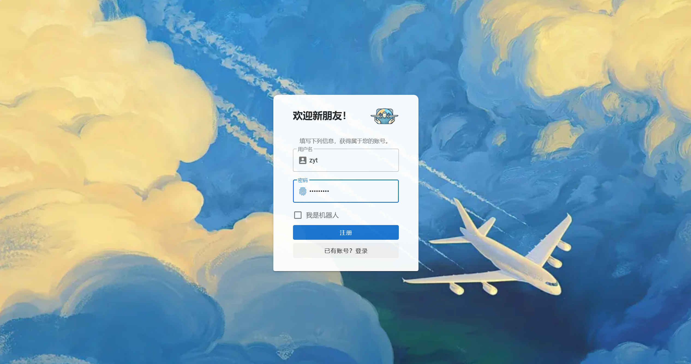

**注解**：

* “欢迎新朋友”右侧图标为本平台的logo。
* 当用户名重复注册时会弹出弹框提醒。
* 当密码不同时含有数字即字母时输入框会变为红色。
* **彩蛋**：当点击“我是机器人”后会弹出交互弹框。

#### 4.1.2 登录界面

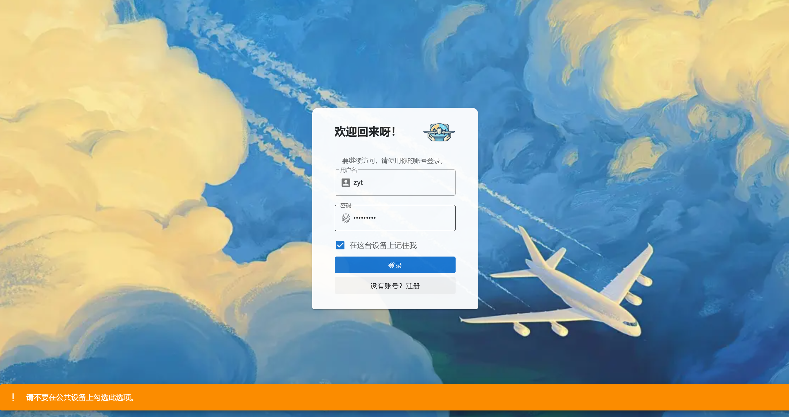

**注解**：

* 可以选择”是否要在这台设备上记住我“。

#### 4.1.3 修改密码

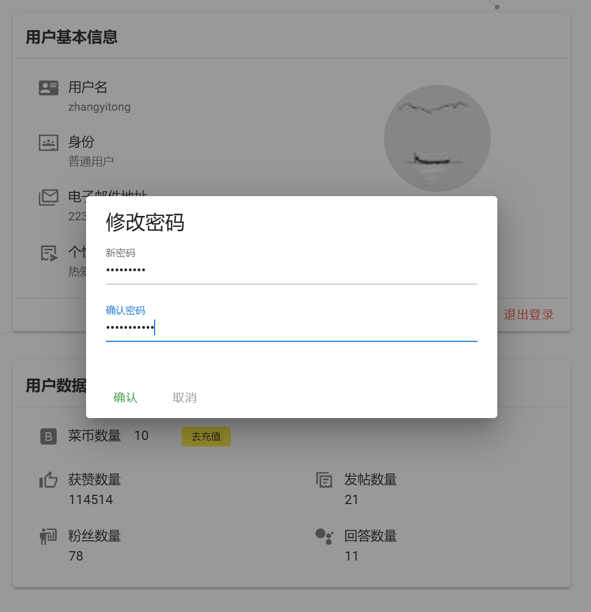

**注解**：

* 当原密码输入错误时，无法修改密码。
* 当新密码不符合长度或者其他要求时，无法修改密码。

#### 4.1.4 退出登录

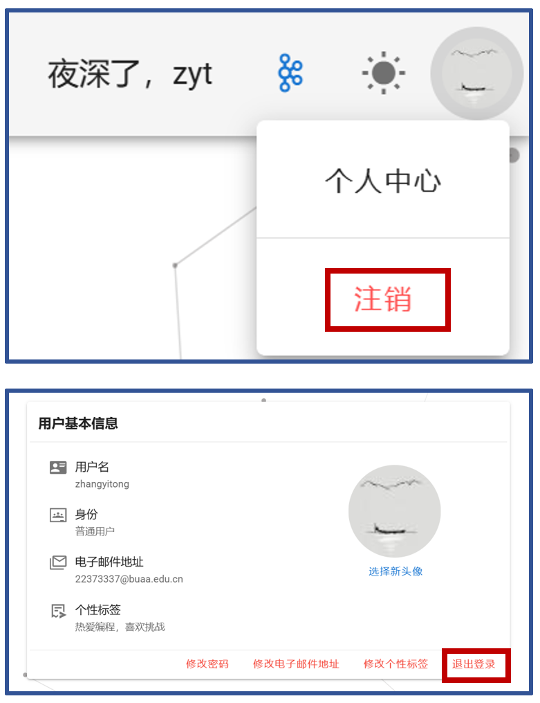

**注解**:

* 用户可以在个人中心和每个页面右上角退出登录。

### 4.2 管理员相关页面

#### 4.2.1 管理用户

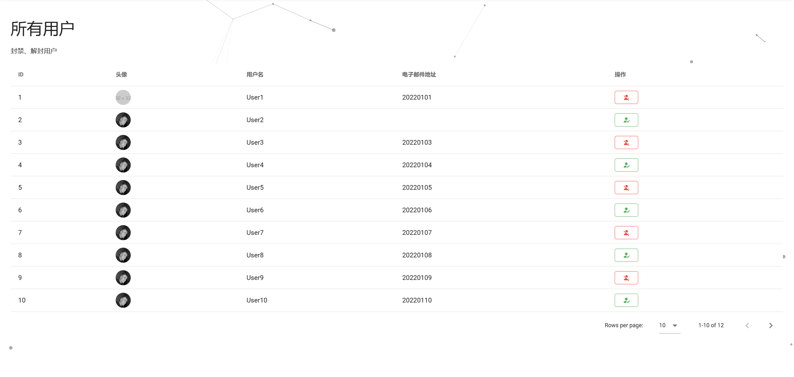

**注解**：

* 管理员可以在此处解封被封禁的账号、封禁违规的账号。
* 在做出解封或者封禁操作前，平台会弹出弹框确认是否要进行操作，以防止管理员的误操作。
* 管理员可以修改每页显示的用户个数。

#### 4.2.2 管理公告

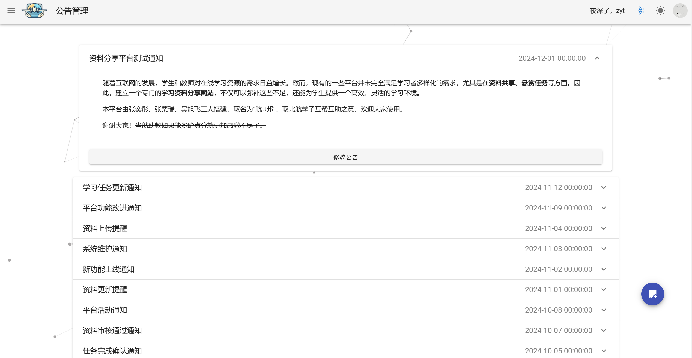


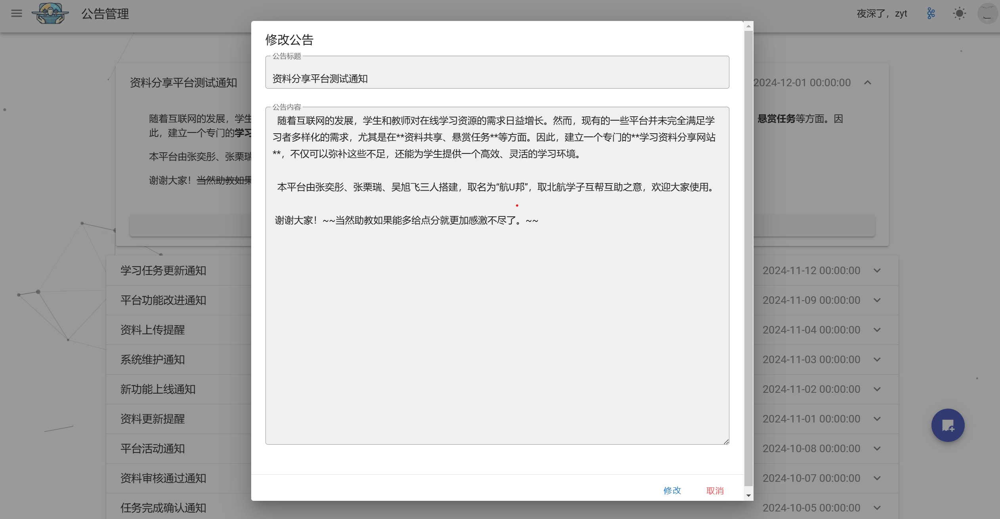

**注解**：

* 管理员可以在此处查看所有公告、并通过点击右侧浮动的按钮发布新的公告，或者通过点击每个公告下方的“修改公告”来修改公告，当管理员将公告内容修改为空时，用户则将无法看到此公告。
* 公告内容支持 Markdown 渲染。

#### 4.2.3 管理分享

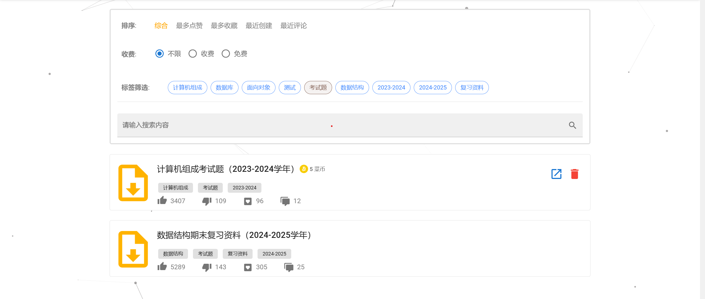

**注解**：

* 管理员有权限看到所有用户分享的所有资源。
* 当鼠标移动到某个资源分享贴上时，会出现**查看**和**删除**按钮，管理员可以据此对资源分析帖进行管理。

#### 4.2.4 管理悬赏

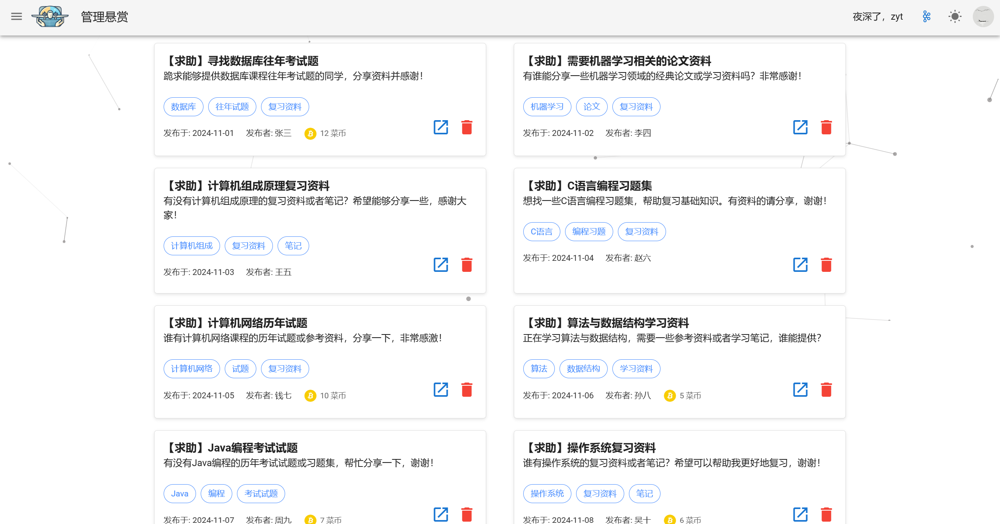

**注解**：

* 管理员有权限看到所有用户发布的所有进行中以及已关闭的悬赏任务。
* 管理员可以在此对悬赏任务进行删除、修改、查看的操作。

### 4.3 共享资源相关页面

#### 4.3.1 共享资源站

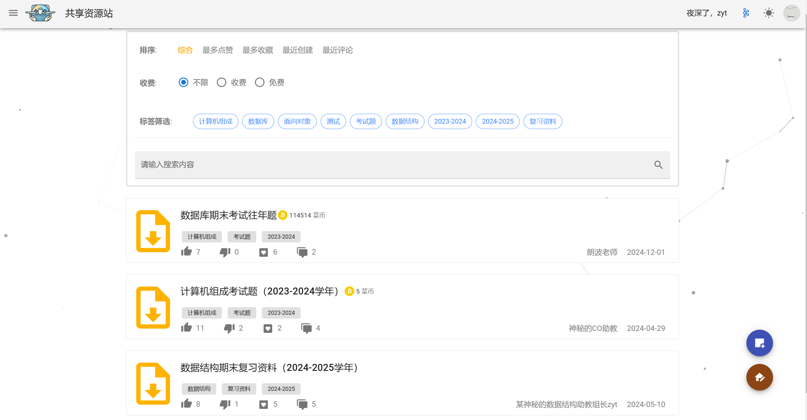

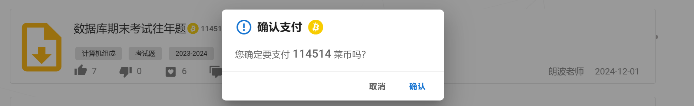

**注解**：

*  共享资源站内可以看到所有用户分享的资料。
* 用户可以选择 **综合（即推荐算法）**、最多点赞、最多收藏、最近创建、最近评论对资源进行排序，可以选择是否收费以及0至多个标签对资源进行筛选，还可以通过输入关键字对资源进行搜索。
* 对于付费资源，用户可以通过支付菜币来进行购买。当菜币数量不足时，会弹出弹框提示。
* 右下角的两个按钮分别是分享新资源和查看我已分享的资源，效果见下文。

#### 4.3.2 查看资源

当资源是免费的或者用户使用菜币购买付费资源后，用户可以查看资源。

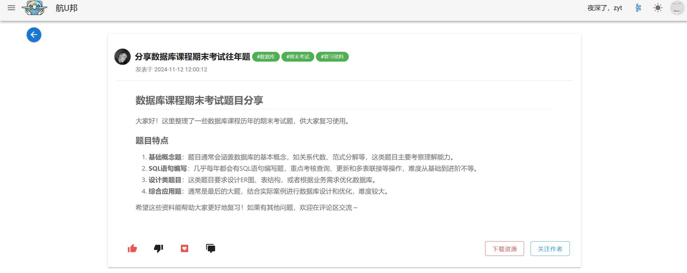

**注解**：

* 用户可以在此查看他人分享的资源的详情。并且可以点击右下角的 **下载资源** 跳转到北航云盘链接，对资源进行下载。
* 用户可以点击下方的点赞/取消点赞、点踩/取消点踩、收藏/取消收藏、关注作者/取消关注按钮。
* 用户可以点击左上角的返回按钮来返回上文介绍的共享资源站。

#### 4.3.3 发布评论

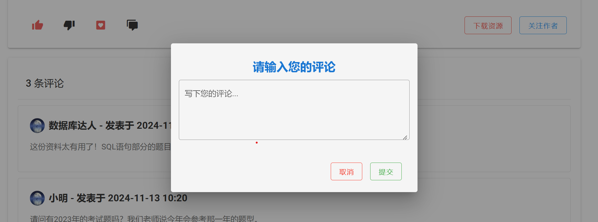

**注解**:

* 用户可以在此发布评论。

#### 4.3.4 查看评论

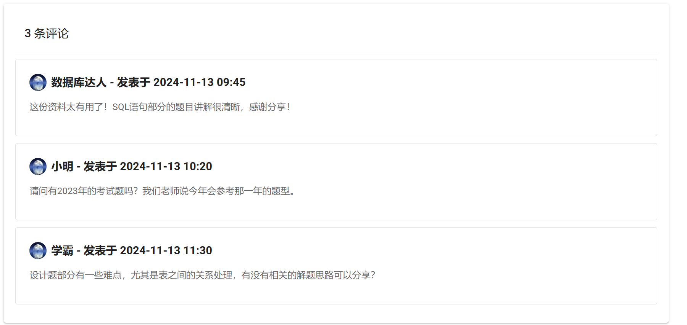

**注解**：

* 用户可以在此查看某帖子下的所有评论以及评论的发布者的信息。

#### 4.3.5 分享资源

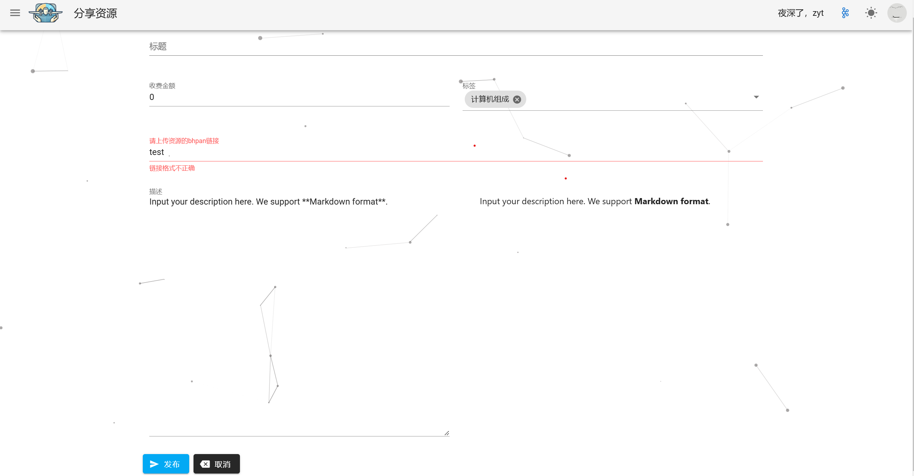

**注解**：

* 用户可以在此分享新的资源。
* 用户必须设置标题以及bhpan链接，这里的bhpan链接便是资源所在url。平台会检测上传的url是否合法。
* 此处的描述支持Markdown渲染以及实时预览。
* 用户可以在此为帖子设置0至多个标签。

#### 4.3.6 管理自己分享的所有资源

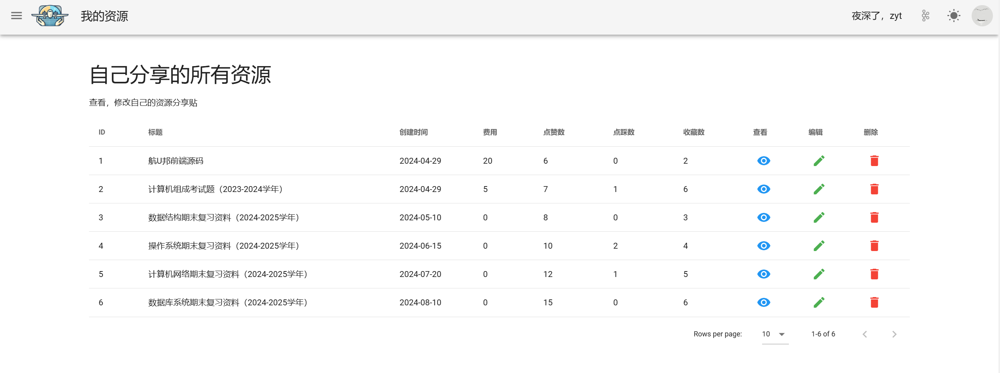

**注解**：

* 在此处用户可以**删除、修改、查看**自己分享的所有共享资源。
* 用户还可以看到自己分享的共享资源的一些统计信息，如点赞数量、收藏数量等。

#### 4.3.7 修改自己分享的资源

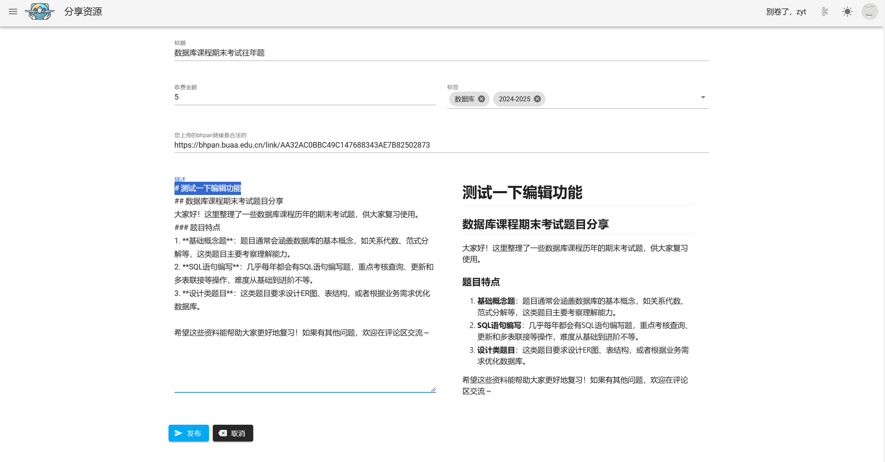

* 用户可以在此修改分享的资源的描述、标题、收费金额、bhpan链接。
* 在进入该页面时，分享的资源的相关未修改信息会填充到对应位置。

### 4.4 任务悬赏相关页面

#### 4.4.1 任务悬赏站

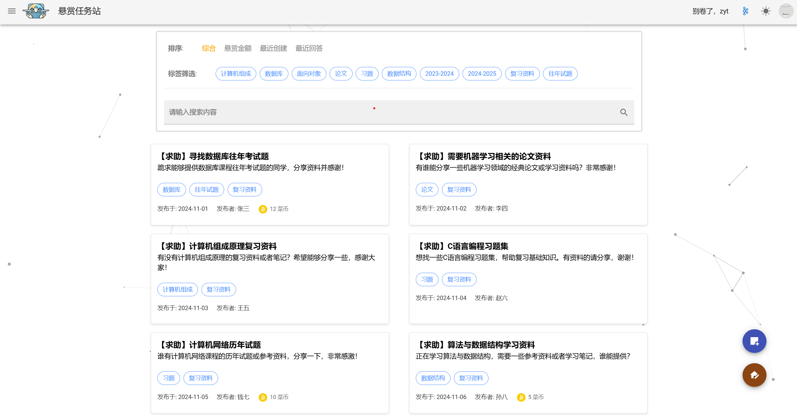

**注解**：

* 悬赏任务站内可以查看所有用户的正在进行中的任务。
* 用户可以选择 **综合（即推荐算法）**、悬赏金额、最近创建、最近回答对悬赏任务进行排序，可以选择一至多个标签对悬赏任务进行筛选，还可以通过输入关键字对悬赏任务进行搜索。
* 右下角的两个按钮分别是发起新的悬赏任务和查看我发起的所有任务（包含进行中的任务和已关闭的任务），效果见下文。

#### 4.4.2 查看悬赏任务

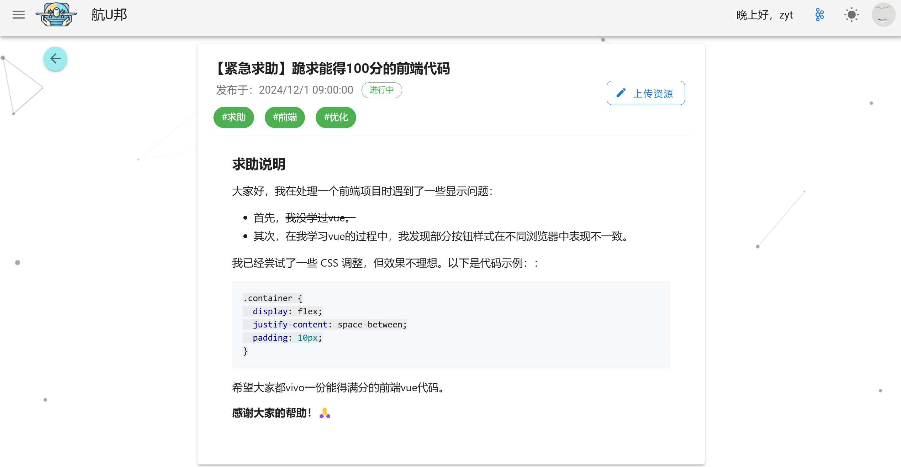

**注解**：

* 用户可以在此查看他人发布的悬赏任务，但是无法看到并下载其他用户上传的资源。
* 用户可以点击右上方的 **上传资源** 按钮，来上传自己的资源作为该悬赏任务的答案。
* 用户可以点击左上角的返回按钮来返回上文介绍的任务悬赏站。

#### 4.4.3 上传答案

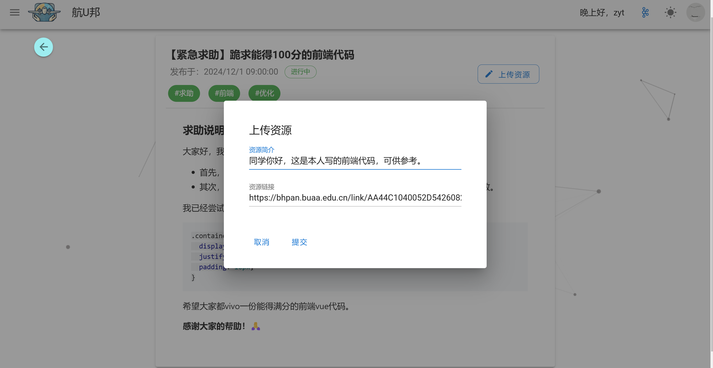

**注解**：

* 用户可以在此解答他人发布的正在进行中的悬赏任务，即上传资源简介及bhpan链接。
* 值得注意的是，在这里会检查bhpan链接的合法性。

#### 4.4.4 发布悬赏任务

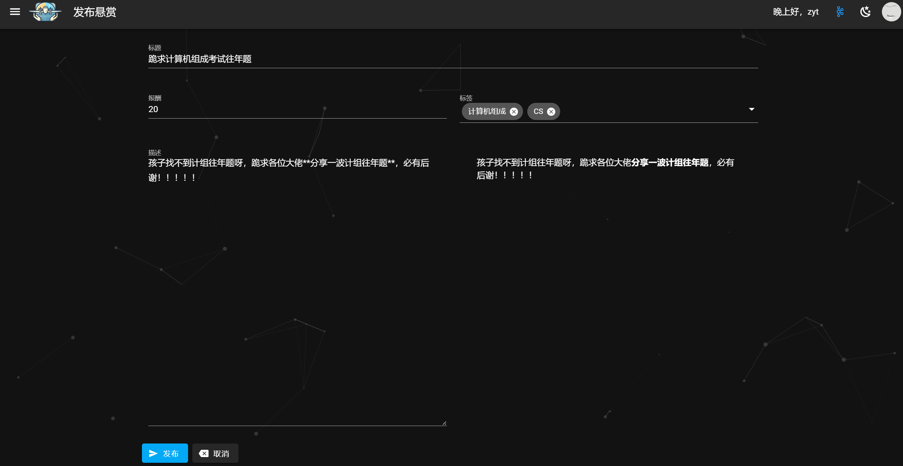

**注解**：

* 用户可以在此发布悬赏任务。
* 用户必须设置标题并设置报酬。报酬可以取0至菜币余额内的任意整数值，笔者在此建议大家尽量取正整数。
* 此处的描述支持Markdown渲染以及实时预览。
* 用户可以在此为此悬赏任务设置0至多个标签。

#### 4.4.5 管理自己发布的所有悬赏任务

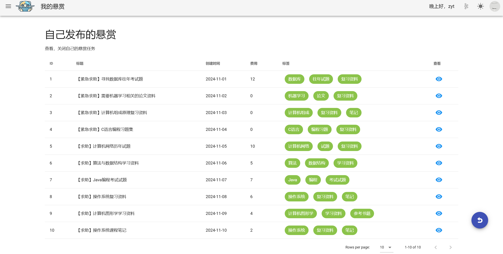

**注解**：

* 在此处用户可以**查看**自己发布的所有悬赏。并可以**关闭**正在进行中的悬赏。
* 点击右下角按钮可以返回上文提到的任务悬赏站。

#### 4.4.6 关闭悬赏

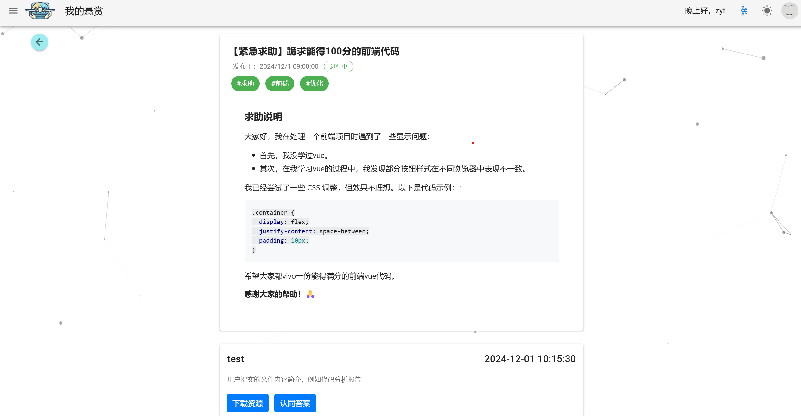


**注解**：

* 悬赏发布者可以在次查看自己的悬赏内容，并且还可以下载所有解答者提交的资源。
* 当悬赏发布者得到满意的答案时，可以点击 **认同答案**。点击后，该悬赏的全部报酬将分发给此答案的上传者，并且该悬赏任务的状态将由 进行中 转变成 已关闭。

### 4.5 用户个人信息相关页面

#### 4.5.1 首页

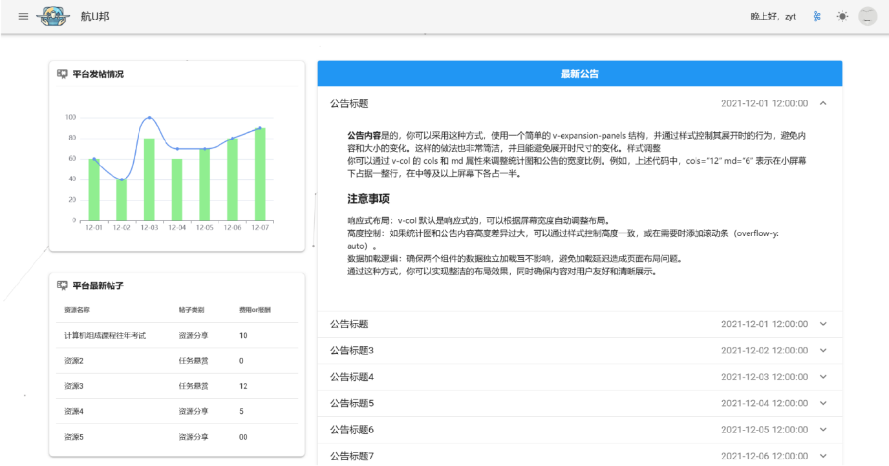

**注解**：

* 用户可以在此查看公开的公告。
* 用户可以在此查看平台过去一周的发帖情况以及最新发帖情况。

#### 4.5.2 查看并修改个人基本信息、查看个人统计数据

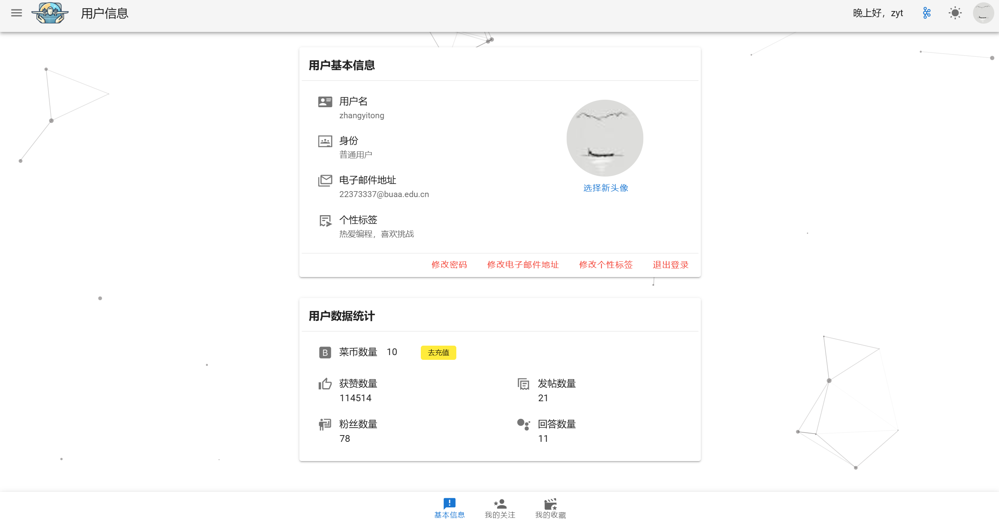

**注解**：

* 用户可以在这里查看、修改自己的电子邮件地址、个性标签等个人信息。
* 用户可以在这里查看平台统计数据，如菜币数量、获赞数量等。

#### 4.5.3 管理我的关注

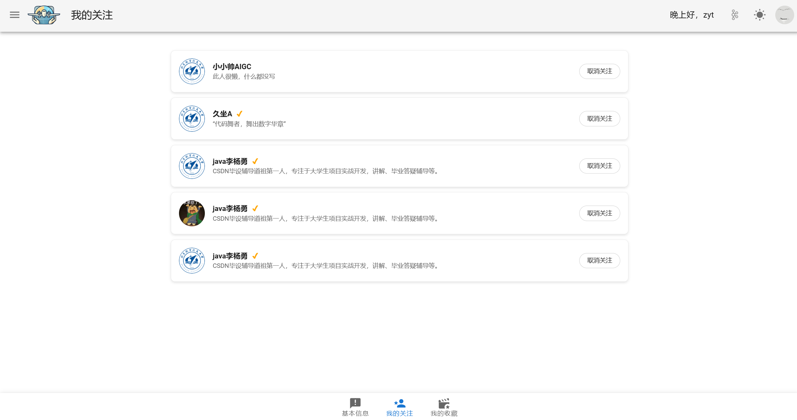

**注解**：

* 用户可以在这里 **查看** 关注列表，还可以在这里 **取消** 对某人的关注。

#### 4.5.4 我的收藏

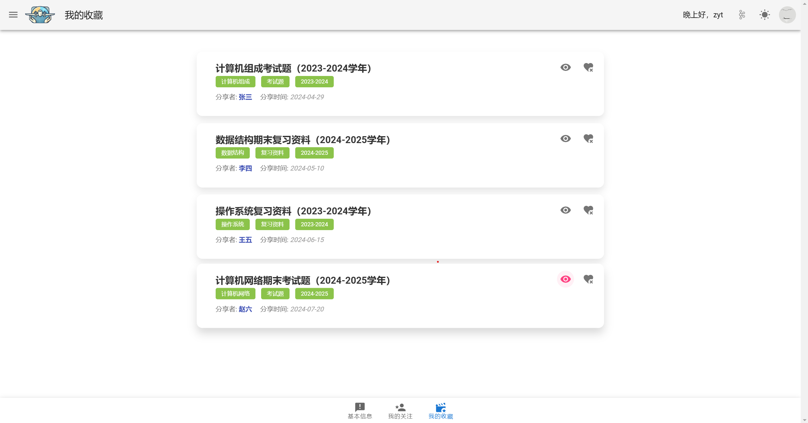

**注解**：

* 用户可以在此处查看自己收藏的他人分享的资源。
* 用户还可以对自己的收藏进行查看、取消收藏的操作。

### 4.6 其他功能实现效果

#### 4.6.1 开启/关闭黑暗模式

此处以共享资源站位例。

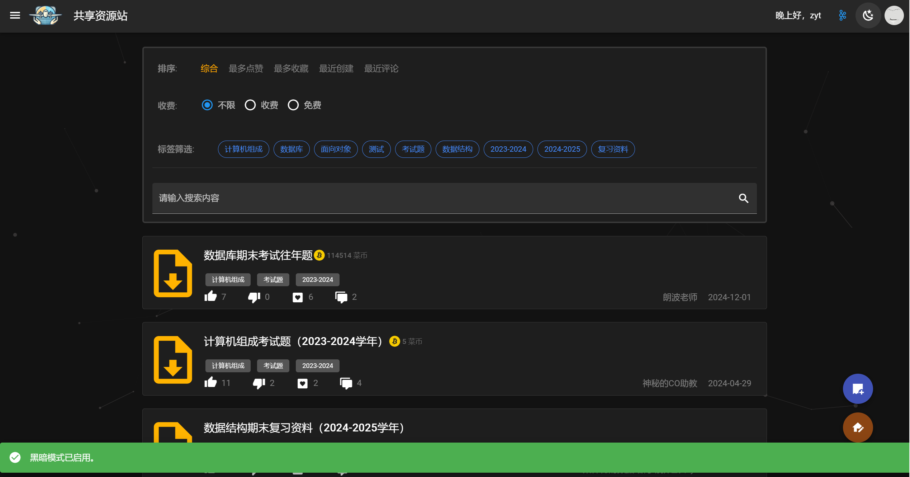

**注解**：

* 用户可以根据环境光照条件，选择开启或者关闭黑暗模式。

#### 4.6.2 开启/关闭背景颗粒效果

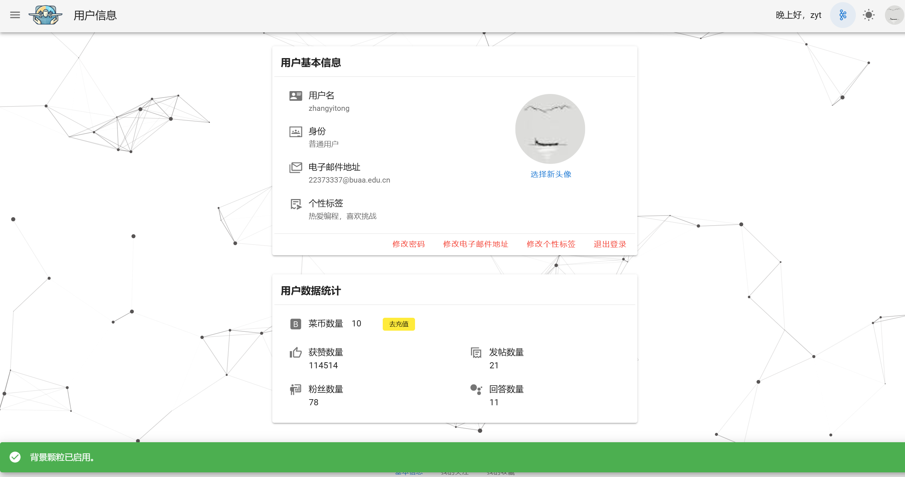

**注解**：

* 用户可以根据个人审美选择开启或者关闭平台提供的背景颗粒效果。

#### 4.6.3 关于我们

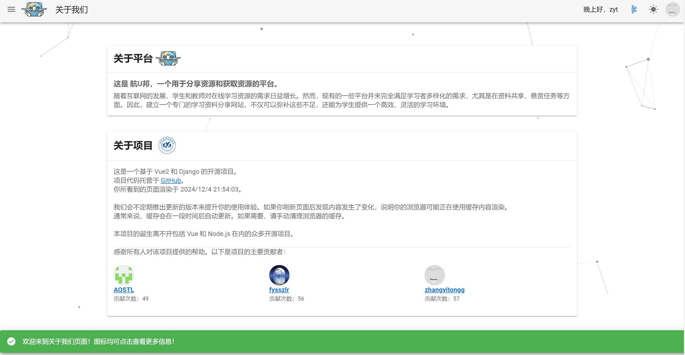

**注解**：

* 平台使用者可以在此查看本平台的相关信息。

---

## 五、组员大作业总结

### 5.1 张奕彤感想

我们小组是在九月末开始着手进行数据库大作业的工作的。起初我们曾讨论是否要借用暑假Python课程的web开发的大作业，我们讨论了一下后感觉在暑假Python大作业的基础上迭代开发是很难锻炼我们的数据库能力的，因此抛弃了这个想法。当时我们小组成员冥思苦想了若干天，最后结合同学们的需求以及数据库课程对增删改查等操作的要求，我们决定搭建一个资源共享平台。

在定下需求后，我们小组原计划是国庆十天肝完数据库大作业。但是当我们真的开始写代码时，我们发现没有提前写好API文档、数据库结构文档，写起代码来真可谓是寸步难行。于是我们小组成员在国庆快结束的时候约了两天研讨室，在研讨室里搓了两天的API文档和数据库结构文档。这让我意识到做开发还是要提前写文档呀！

在写完文档后，我们又紧锣密鼓地写起了第二版代码。就在我们写得正酣畅淋漓的时候，我们学到了范式。我们突然意识到我们的数据库结构好多不符合第三范式。于是我们又暂停了代码方面的工作，花了一大段时间修改我们的数据库结构文档，将关系全都约定到了第三范式或者BCNF。唉，以后做各种事情还是应当看好具体地要求呀~~，十分惨痛的一个教训~~。

最后，我们便顺利地开始了代码方面的工作。在这段工作中，我主要负责的是前端结构的设计与开发，也参与了一些后端debug的工作。在这个过程中，我前端开发的能力大幅提高，对SQL语言的熟练程度也增加了不少，更重要的是在完成本次大作业的过程中，我们小组三位同学的配合程度变得越来越高，相信可以6系接下来的软件工程课程中继续很好地合作。

唯一比较遗憾的是，由于临近烤漆和编译大作业ddl，我们小组没能拿出大把时间美化前端界面，没能使前端界面达到自己的期望。不过总的来说，本次数据库大作业确确实实完成了它的任务——培养了我们的数据库设计能力、培养了我们的团队合作精神。

### 5.2 张栗瑞感想

在大学的学习旅程中，每一门课程都是一次新的探索与成长的机会。回顾这个学期的数据库课程，它不仅为我打开了通往数据管理世界的大门，更是在多个层面上丰富了我的技能库和知识体系。从理论学习到实践操作，再到团队合作和个人能力的成长，这门课程所带来的收获是全方位且深远的。

在理论学习方面，我们系统地掌握了数据库的基本概念、原理以及设计模式。通过深入学习关系型数据库、SQL语言、事务处理、并发控制等内容，我们对数据存储与检索有了更为宏观的理解。这些理论知识为我们后续的实际操作奠定了坚实的基础，并帮助我们以更加专业的眼光去审视和解决问题。

实践课部分无疑是这段学习经历中的亮点之一。从最初的数据库设计流程，到实现具体的指令、索引、触发器及存储过程等元素，每一步都是对我们动手能力和逻辑思维的锻炼。刚开始时，我们或许还处于摸索阶段，但随着项目的推进，我们逐渐找到了默契的工作方式。分工明确、沟通顺畅，每一个人都能在自己的岗位上发挥出最大的价值。尤其是在面对挑战和困难时，大家能够齐心协力寻找解决方案，这种精神让我深刻体会到集体智慧的力量。值得一提的是，我实现了一个为用户定向推荐帖子的功能。为了实现这个目标，我们首先对用户行为数据进行了详尽的分析，包括浏览历史、点击记录、购买行为等多维度信息。基于这些数据，我们选用了广告推荐模型作为推荐系统的理论基础，因为它能够很好地捕捉到用户的兴趣偏好，并据此预测他们可能感兴趣的帖子。

最后，不得不提的是这次大作业对于个人能力的提升。无论是前端开发还是后端编程，亦或是两者之间的交互，我们都经历了从零开始的学习过程。在这个过程中，我们不仅提高了技术水平，更重要的是培养了独立思考、解决实际问题的能力。同时，为了确保系统的美观性和用户体验，我们也投入了大量的时间研究UI/UX设计原则，从而提升了审美鉴赏力。

总之，这个学期的数据库课程对我来说是一次难忘的经历。感谢老师和助教们的辛勤付出，正是他们无私的帮助和支持，才使得我们可以顺利完成这一系列富有挑战性的任务。未来无论是否继续从事相关领域的工作，这段学习经历所赋予的知识与技能都将伴随我前行，成为宝贵的财富。

### 5.3 吴旭飞感想

在这次数据库大作业中，从零开始设计一个前后端分离的网站架构、数据库设计和实现的过程。回顾整个项目，我们不仅在技术能力上获得了显著提升，更在团队协作和项目管理上积累了宝贵的经验。

- 设计API的水平提升
在项目初期，我们小组成员都已经具备了基本的Python编程能力，但对API设计的理解和实践较为薄弱。通过完成项目，我逐步掌握了如何高效设计API。
首先，我学会了如何设计RESTful风格的API，通过合理的路由、请求方式（GET、POST、PUT、DELETE）以及响应的状态码，使得API设计更加规范和易用。在开发过程中，我重视API接口的简洁性与可扩展性，确保前后端能够顺畅对接。
我还了解了API版本控制、参数验证和错误处理的重要性。在数据返回时，我也学会了如何使用标准的JSON格式和自定义响应模型，确保前端可以高效获取和处理数据。
在项目过程中，我还加强了对异步API的理解，学会了如何通过异步支持提升API的性能。这些实践帮助我们逐步提升了API设计的能力，能够更好地满足系统需求。

- Vue.js前端开发能力的提升
在前端部分，我们选择了Vue2框架，尽管之前我们没有太多前端开发经验，但随着项目的推进，我们的Vue.js开发能力有了显著提升。从最基础的页面搭建，到后期的组件化开发，我们逐渐掌握了Vue的核心思想，如指令、生命周期、组件间通信等。
在开发过程中，我们重点学习了Vue的双向数据绑定和响应式设计。通过Vue的v-model、computed和watch，我们能够实现更加动态和灵活的前端交互。此外，我们通过axios与后端接口进行数据交互，优化了前端和后端的协作，熟悉了前端与API的通信方式。
在CSS方面，我们面临着如何在保证功能的前提下使页面变得更加美观的问题。最初，我们在处理页面布局和样式时遇到了困难，尤其是CSS的定位问题。通过多次调整，我们逐渐掌握了CSS的基本技巧，并能够合理运用flexbox和grid布局，使得页面更加简洁、易用。

- 数据库设计与SQL能力的提升
在数据库设计方面，我们从最初的简单ER图和数据流图设计开始，到后期的存储过程和复杂的查询实现，逐步掌握了数据库设计的核心概念。在需求分析阶段，我们通过调研和讨论确定了系统的核心功能，并绘制了详细的ER图和数据流图，确保数据的流畅流通和功能的完备性。

- 团队合作与项目管理的提升
这次项目不仅是我们技术能力的提升，也是团队合作能力的锻炼。从最初的需求讨论，到后期的功能实现和优化，我们小组成员充分发挥各自的优势，分工协作，互相支持。每周的组会和不定期的线上讨论使我们能够快速解决问题，避免了进度的拖延。
在项目的后期，我们的协作能力得到了极大的提升。我们不仅在技术上互相帮助，还在项目管理上相互配合，合理分配任务，确保了项目的顺利进行。

经过这四个月的努力，我们不仅掌握了Python、Vue和数据库方面的技术，还深刻体验到团队合作与项目管理的重要性。通过这次数据库大作业，我们的技术能力得到了大幅提升，尤其是在后端API设计、前端交互和数据库设计上，积累了宝贵的实践经验。这个项目不仅让我们学到了许多技术，更锻炼了我们解决问题的能力，也让我们对前后端开发有了更全面的认识。
