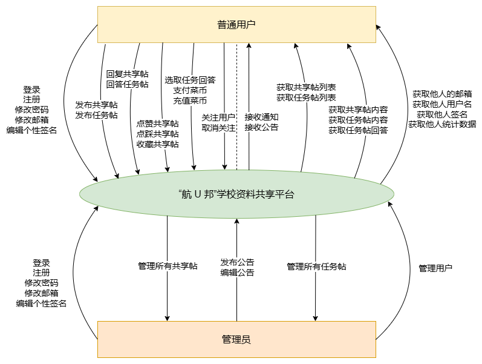
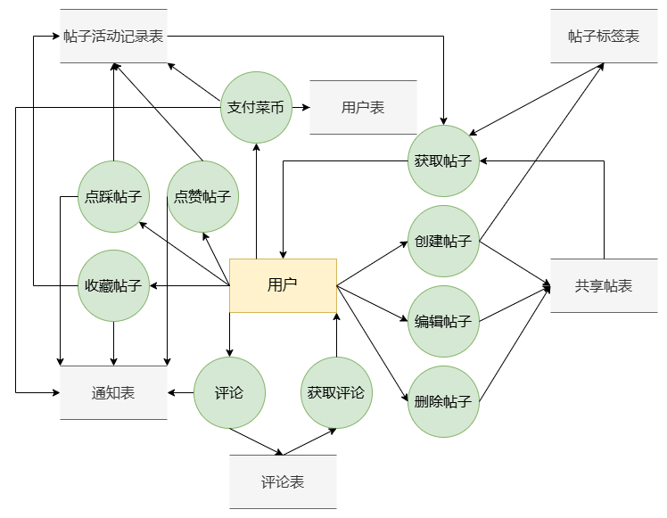
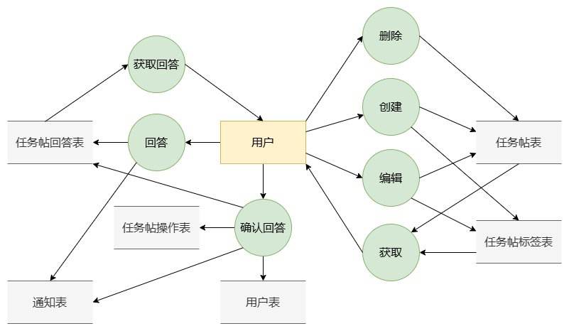
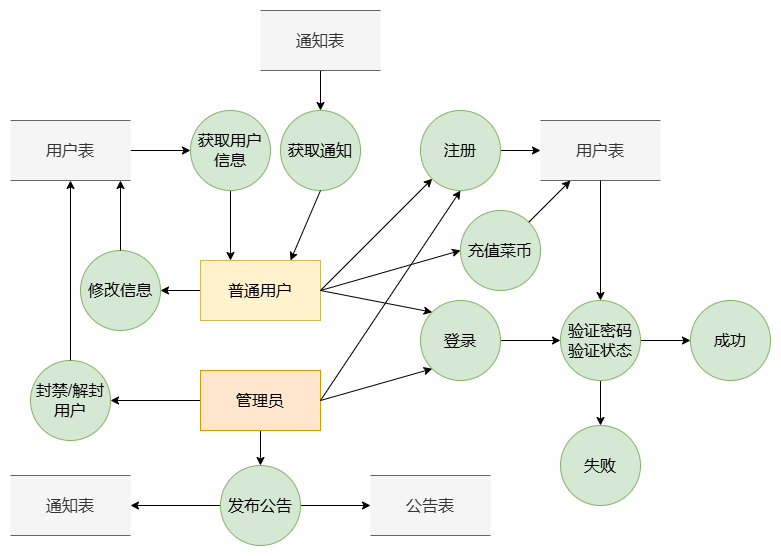
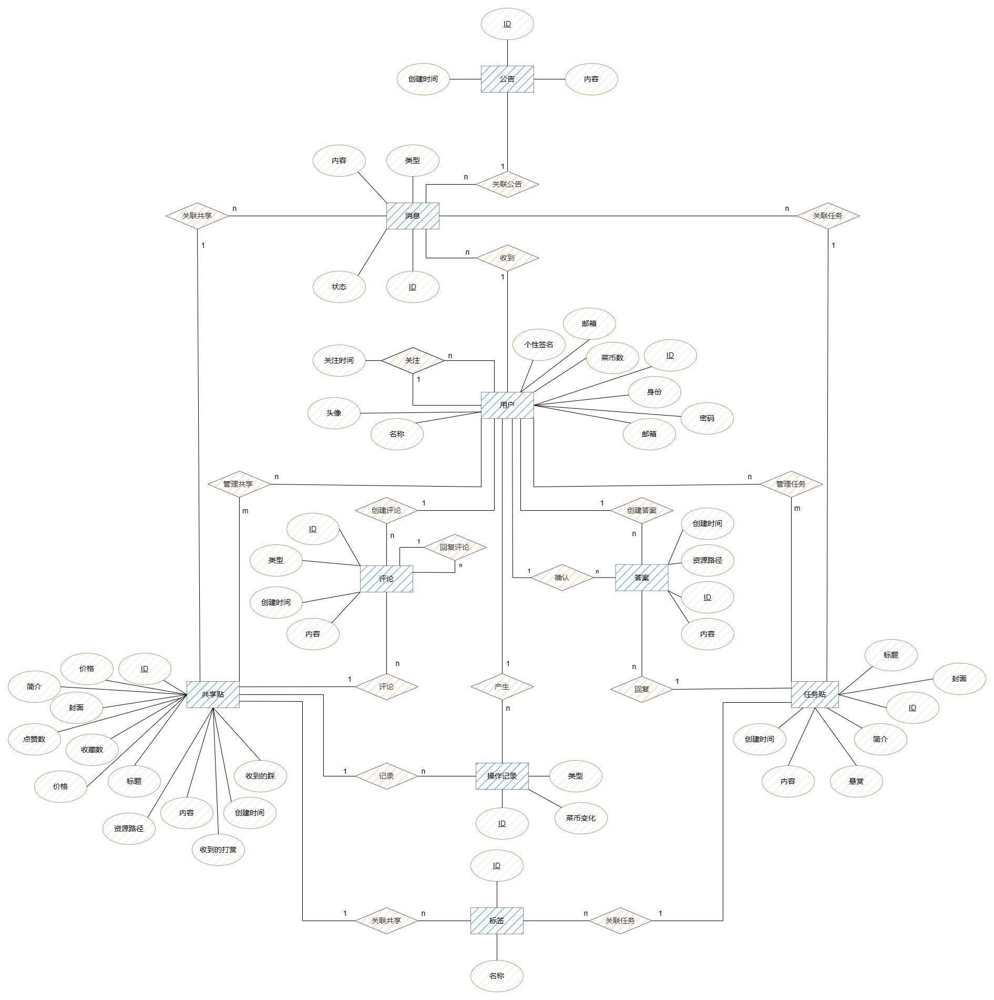
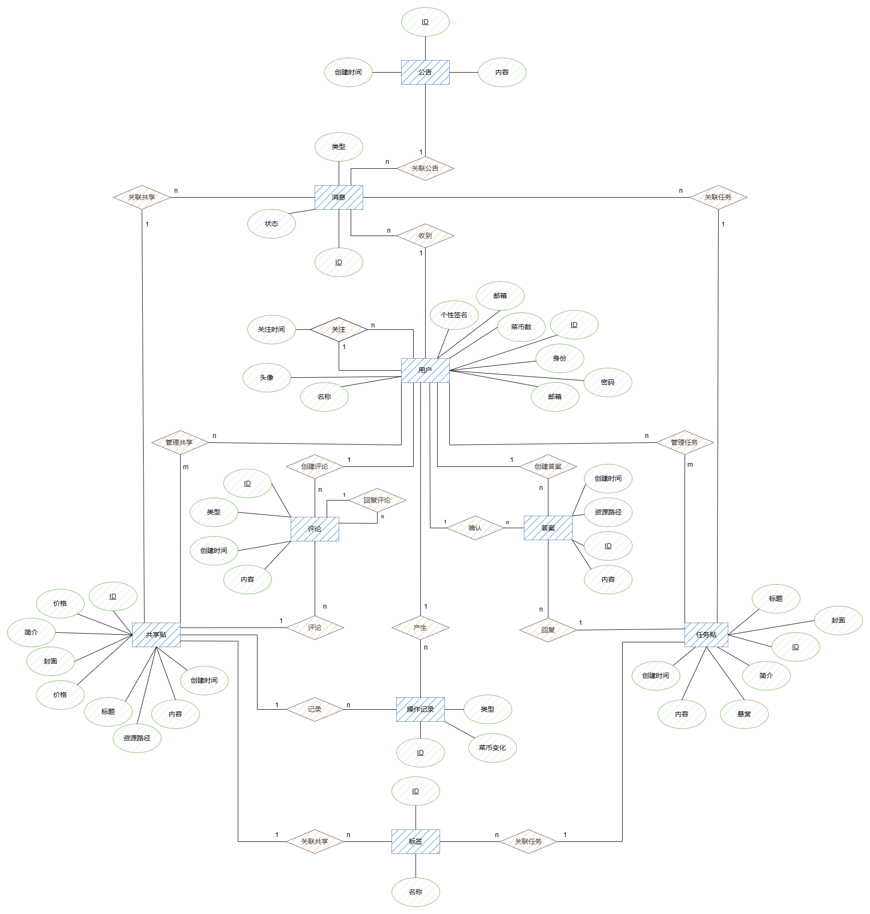
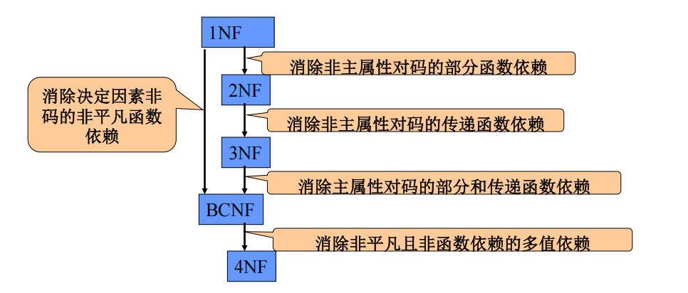

[toc] 

## 一、需求分析

### 1.1 需求描述

#### 1.1.1 总论

在过去的几十年中，随着计算机技术的不断进步和信息网络的覆盖面不断扩大，互联网已经成为人们获取信息、交流思想的重要工具。而在这个信息爆炸的时代，如何高效地获取、管理和共享信息成为一个亟待解决的问题。特别是对于北京航空航天大学这所以信息技术专业见长的高校的学生来说，互联网不仅仅是一个获取娱乐信息的途径，更应当是获取学习资源、交流和合作的有效平台。

目前，我校师生在进行资料分享时，仍然依赖传统的线下分享方式或是在微信、QQ等平台上线上分享的方式，这种方式不仅效率低下，而且面临着数据存储、维护和更新等方面的挑战。此外，传统的资料分享方式往往缺乏对学习过程的追踪和分析，也无法满足学生个性化的学习需求。在这种情况下，设计一个集成化、信息化的校园资料分享平台显得尤为重要。建设一个功能全面、操作简便的学习资料分享平台，不仅能有效弥补现有系统的不足，还能为学生和教师提供一个高效、灵活的学习环境，推动教育信息化的进一步发展。

因此，我们计划开发一个名为“**航U邦**”的**学习资料共享平台**，取北航学子互帮互助之意，旨在通过将互联网与现代信息技术相结合，依托全部师生均可以使用的北航云盘，提供一个高效、可靠且便捷的资料共享环境。学生可以通过该平台自由**下载学习资料、分享学习资料、解答悬赏任务、发布悬赏任务**。通过采用电子化存储和管理方式，平台不仅可以大幅度提高资料的查找、更新和维护效率，还能为学生提供实时的资料查询和任务反馈。除此之外，本平台创造性地开发了“**菜币**”虚拟货币系统，平台应用者可以使用菜币发布悬赏任务、购买收费资源，还可以通过分享高质量资源、解答他人任务等方式获取菜币。

#### 1.1.2 管理员相关功能

* 管理公告：查看公告、发布公告、修改公共、删除公告。
* 管理用户：查看用户、封禁用户、解封用户。
* 管理分享：搜索分享资源、查看分享资源、删除分享资源。
* 管理悬赏：搜索悬赏任务、查看悬赏任务、删除悬赏任务。

#### 1.1.3 用户个人信息相关功能

* 查看公告：用户可以看到管理员发布的公告。
* 修改个人基本信息：修改密码、修改电子邮件地址、修改个性标签、修改头像。
* 查看个人数据：查看菜币数量、查看获赞数量、查看发帖次数、查看回答次数、查看粉丝数量。
* 关注/取消关注其他用户。
* 收藏/取消收藏其他用户。
* 退出登录。
* 打开/关闭黑暗模式，打开/关闭背景颗粒。

#### 1.1.4 共享资源相关功能

* 对资源进行筛选：可以依据是否收费、标签（tags）对共享资源进行筛选。
* 对资源进行排序：可以选择 最推荐、最多点赞、最多收藏、最近创建、最近评论 对共享资源进行排序。
* 对资源进行搜索：平台支持依据关键词对资源进行模糊搜索。
* 购买付费资源。
* 查看资源：查看资源点赞数量、收藏数量、评论数量、点踩数量；查看资源介绍以及标签。
* 查看某资源的评论。
* 下载资源：用户可以通过北航云盘下载免费资源或者已经购买了的资源。
* 获取自己分享的所有资源。
* 编辑自己分享的资源。
* 删除自己分享的资源。
* 分享新资源：用户可以自由地分享资源，并设定标题、收费金额、标签、描述等关键信息。

#### 1.1.5 任务悬赏相关功能

* 对悬赏进行筛选：可以依据标签（tags）对任务悬赏进行筛选。
* 对悬赏进行排序：可以选择 最推荐、悬赏金额、最近创建、最近回答 对任务悬赏进行筛选。
* 对悬赏进行搜索：平台支持依据关键词对悬赏进行模糊搜索。
* 查看悬赏内容：查看悬赏的题目、状态（一般为进行中）、标签、发布时间、悬赏需求。
* 解答悬赏任务：对某个特定的悬赏上传特定的资源。
* 获取自己发布的所有悬赏任务。
* 发布新悬赏：用户可以发布新的悬赏任务，并设定标题、报酬、标签、悬赏需求等关键信息。
* 下载解答者提供的资源：某悬赏的发布者可以下载解答者上传的资源，其他用户则无法看到该资源。
* 关闭悬赏：某悬赏的发布者可以选择某一个解答者上传的资源作为最佳答案，并将报酬支付给该解答者，以关闭该悬赏。

### 1.2 数据流图

#### 1.2.1 总体数据流图



#### 1.2.2 共享帖数据流图



#### 1.2.3 任务帖部分数据流图



#### 1.2.4 用户管理部分数据流图




### 1.3 数据元素表

> 本项目所用数据库均设计为BCNF，旨在消除任何形式的冗余和异常，确保数据的一致性和完整性。我们保证了所有非主属性完全函数依赖于候选键，并且每一个决定因素都是超键，从而避免了更新、插入和删除操作中可能出现的异常情况。在设计过程中，我们对每个关系模式进行了细致分析，确保满足BCNF的要求，同时考虑到实际应用中的查询效率和维护成本，对某些表结构进行了合理的调整，以求在理论规范和实际性能之间取得平衡。

#### 1.3.1 用户表（Users）

| 字段名称      | 类型         | 备注                                         |
| ------------- | ------------ | -------------------------------------------- |
| <u>UserId</u> | INT          | PK，用户创建时唯一指定                       |
| Name          | VARCHAR(50)  | 昵称                                         |
| Email         | VARCHAR(100) | 邮箱                                         |
| Keyword       | VARCHAR(50)  | 密码，建议前端对格式做限定                   |
| Status        | VARCHAR(50)  | 仅有三种值：User、Administrator、Root        |
| Avatar        | VARCHAR(255) | 头像路径                                     |
| Profile       | VARCHAR(200) | 个人简介                                     |
| Coin          | INT          | 菜币数量                                     |
| Color         | BOOLEAN      | 0：黑暗模式、1：背景颗粒                     |
| Token         | VARCHAR(200) | 没想好鉴权模式，感觉直接放数据库里也不是不行 |

#### 1.3.2 基础消息表（Messages）

| 字段名称         | 类型        | 备注                                                   |
| ---------------- | ----------- | ------------------------------------------------------ |
| <u>MessageId</u> | INT         | PK，消息创建时唯一指定                                 |
| *UserId*         | INT         | FK，关联到Users，消息展示给的用户                      |
| Type             | VARCHAR(50) | 仅有五种值：Notice、Comment、Reply、Answer、Reward[^1] |
| Read             | BOOLEAN     | 0：未读、1：已读                                       |

#### 1.3.3 公告消息表（NoticeMessages）

| 字段名称         | 类型 | 备注                                      |
| ---------------- | ---- | ----------------------------------------- |
| <u>MessageId</u> | INT  | PK，FK，关联到BaseMessages.MessageId      |
| *NoticeId*       | INT  | FK，关联到Notices，仅当Type为Notice时有效 |

#### 1.3.4 共享消息表（ShareMessages）

| 字段名称         | 类型 | 备注                                             |
| ---------------- | ---- | ------------------------------------------------ |
| <u>MessageId</u> | INT  | PK，FK，关联到BaseMessages.MessageId             |
| *ShareId*        | INT  | FK，关联到Shares，仅当Type为Comment或Reply时有效 |

#### 1.3.5 互助消息表（RewardMessages）

| 字段名称         | 类型 | 备注                                              |
| ---------------- | ---- | ------------------------------------------------- |
| <u>MessageId</u> | INT  | PK，FK，关联到BaseMessages.MessageId              |
| *RewardId*       | INT  | FK，关联到Rewards，仅当Type为Answer或Reward时有效 |

[^1]: Notice：公告更新通知，Comment：评论通知，Reply：回复通知，Answer：收到回复通知，Reward：收获打赏通知

#### 1.3.6 关注表（Follows）

| 字段名称        | 类型     | 备注                        |
| --------------- | -------- | --------------------------- |
| <u>FollowId</u> | INT      | PK，关注时唯一指定          |
| *FromId*        | INT      | FK，关联到Users，关注者id   |
| *ToId*          | INT      | FK，关联到Users，被关注者id |
| Data            | DATETIME | 关注时间                    |

#### 1.3.7 公告表（Notices）

| 字段名称        | 类型     | 备注                   |
| --------------- | -------- | ---------------------- |
| <u>NoticeId</u> | INT      | PK，公告创建时唯一指定 |
| Text            | TEXT     | 公告内容               |
| Data            | DATETIME | 创建时间               |

#### 1.3.8 标签表（Tags）

| 字段名称     | 类型        | 备注                   |
| ------------ | ----------- | ---------------------- |
| <u>TagId</u> | INT         | PK，标签创建时唯一指定 |
| Name         | VARCHAR(50) | 标签名                 |

#### 1.3.9 共享表（Shares）

| 字段名称       | 类型         | 备注                      |
| -------------- | ------------ | ------------------------- |
| <u>ShareId</u> | INT          | PK，创建分享时唯一指定    |
| Headline       | VARCHAR(50)  | 标题                      |
| Price          | INT          | 价格，免费则为0           |
| *CreatorId*    | INT          | FK，关联到Users，创建者id |
| Text           | TEXT         | 文章内容                  |
| Cover          | VARCHAR(255) | 封面路径                  |
| Profile        | VARCHAR(200) | 简介                      |
| ResourceLink   | VARCHAR(255) | 资源路径                  |
| Like           | INT          | 点赞数量                  |
| Dislike        | INT          | 点踩数量                  |
| Coin           | INT          | 菜币数量                  |
| Favourite      | INT          | 收藏数量                  |
| Data           | DATETIME     | 创建时间                  |

#### 1.3.10 共享标签表（ShareTags）

| 字段名称          | 类型 | 备注                           |
| ----------------- | ---- | ------------------------------ |
| <u>ShareTagId</u> | INT  | PK，创建共享帖子标签时唯一指定 |
| *ShareId*         | INT  | FK，关联到Shares，帖子id       |
| *CreatorId*       | INT  | FK，关联到Users，创建者id      |
| *TagId*           | INT  | FK，关联到Tags，标签id         |

#### 1.3.11 共享操作表（ShareOperators）

| 字段名称               | 类型        | 备注                                                      |
| ---------------------- | ----------- | --------------------------------------------------------- |
| <u>ShareOperatorId</u> | INT         | PK，进行操作时唯一指定                                    |
| *ShareId*              | INT         | FK，关联到Shares                                          |
| *UserId*               | INT         | FK，关联到Users                                           |
| Type                   | VARCHAR(50) | 只能有5种值：Purchase、Like、Dislike、Coin、Favourite[^2] |
| Coin                   | INT         | 投币数量，仅Type为Coin时有效                              |
| Data                   | DATETIME    | 操作时间                                                  |

[^2]: Purchase购买，Like点赞，Dislike点踩，Coin投币，Favourite收藏

#### 1.3.12 共享评论表（Comments）

| 字段名称         | 类型        | 备注                                                      |
| ---------------- | ----------- | --------------------------------------------------------- |
| <u>CommentId</u> | INT         | PK，创建评论时唯一指定                                    |
| Type             | VARCHAR(50) | 仅有两种值：Comment，Reply（回复帖子、回复回复）          |
| *ShareId*        | INT         | FK，关联到Shares，帖子id                                  |
| *ReplyId*        | INT         | FK，关联到Comments，被回复的评论id，仅当Type为Reply时有效 |
| Text             | TEXT        | 回复正文                                                  |
| Data             | DATETIME    | 创建时间                                                  |

#### 1.3.13 评论操作表（CommentOperators）

| 字段名称                 | 类型        | 备注                       |
| ------------------------ | ----------- | -------------------------- |
| <u>CommentOperatorId</u> | INT         | PK，进行操作时唯一指定     |
| *CommentId*              | INT         | FK，关联到Shares           |
| *UserId*                 | INT         | FK，关联到Users            |
| Type                     | VARCHAR(50) | 只能有2种值：Like、Dislike |
| Data                     | DATETIME    | 操作时间                   |

#### 1.3.14 互助表（Rewards）

| 字段名称        | 类型         | 备注                                 |
| --------------- | ------------ | ------------------------------------ |
| <u>RewardId</u> | INT          | PK，创建互助贴时唯一指定             |
| Headline        | VARCHAR(50)  | 标题                                 |
| Reward          | INT          | 悬赏金额                             |
| *CreatorId*     | INT          | FK，关联到Users，创建者id            |
| Text            | TEXT         | 文章内容                             |
| Cover           | VARCHAR(255) | 封面路径                             |
| Profile         | VARCHAR(200) | 简介                                 |
| Data            | DATETIME     | 创建时间                             |
| Coin            | INT          | 收获菜币数目，仅当Type为Reward时有效 |

#### 1.3.15 互助标签表（RewardTags）

| 字段名称           | 类型 | 备注                           |
| ------------------ | ---- | ------------------------------ |
| <u>RewardTagId</u> | INT  | PK，创建互助帖子标签时唯一指定 |
| *RewardId*         | INT  | FK，关联到Shares，帖子id       |
| *TagId*            | INT  | FK，关联到Tags，标签id         |

#### 1.3.16 互助评论表（Answers）

| 字段名称        | 类型         | 备注                          |
| --------------- | ------------ | ----------------------------- |
| <u>AnswerId</u> | INT          | PK，互助评论创建时唯一指定    |
| *RewardId*      | INT          | FK，关联到Rewards，共享标签id |
| CreatorId       | INT          | FK，关联到Users，创建者id     |
| Text            | TEXT         | 回复内容                      |
| ResourceLink    | VARCHAR(255) | 资源路径                      |
| Data            | DATETIME     | 评论时间                      |

---

## 二、数据库概念模式设计

### 系统初步E-R图



### 系统基本E-R图

分析系统初步 E-R 图，我们发现可以消除以下冗余数据：

- 消息中的内容可以通过关联的实体导出，因此不必作为一个单独的属性
- 共享帖里的收藏数、点赞数、打赏数、点踩数可以通过操作记录得出

我们的初步 E-R 图里没有冗余联系，因此得到基本 E-R 图如下，共**九**个实体：



---

## 三、数据库逻辑模式设计与优化

### 3.1 数据库关系模式定义

#### 3.1.1 实体

1. 用户(<u>id</u>, 身份, 名称, 菜币余额, 头像, 个性签名, 邮箱, 密码);

2. 共享资源(<u>id</u>, 标题, 价格, 内容, 创建时间, 简介, 资源路径);
3. 评论(<u>id</u>, 类型, 创建时间, 内容);

3. 悬赏任务(<u>id</u>, 标题, 悬赏金额, 内容, 创建时间, 简介);
4. 答案(<u>id</u>, 内容, 资源路径, 创建时间);

4. 公告(<u>id</u>, 创建时间, 内容)；

5. 消息(<u>id</u>, 类型, 状态);

8. 操作记录(<u>id</u>, 菜币变化值, 类型);

9. 标签(<u>id</u>, 名称);

#### 3.1.2 联系

1. 用户-共享资源(<u>用户id</u>, <u>共享资源id</u>);
2. 用户-悬赏任务(<u>用户id</u>, <u>悬赏任务id</u>);
3. 用户-用户(<u>用户id1</u>, 用户id2, 关注时间);
4. 操作记录-用户(<u>操作记录id</u>, 用户id);
5. 评论-用户(<u>评论id</u>, 用户);
6. 回答-用户(<u>回答id</u>, 用户);
7. 用户-消息(<u>消息id</u>, 用户id)
8. 公告-消息(<u>消息id</u>, 公告id);
9. 共享资源-消息(<u>消息id</u>, 共享资源id);
10. 悬赏任务-消息(<u>消息id</u>, 悬赏任务id);
11. 回答-悬赏任务(<u>回答id</u>, 悬赏任务id);
12. 评论-评论(<u>评论id1</u>, 评论id2);
13. 评论-共享资源(<u>评论id</u>, 共享资源id);
14. 操作记录-共享资源(<u>操作记录id</u>, 共享资源id);
15. 标签-共享资源(<u>标签id</u>, 共享资源id);
16. 标签-悬赏任务(<u>标签id</u>, 悬赏任务id)；

### 3.2 关系模式范式等级的判定与规范化

接下来我们遵循下图中的原则对关系模式的范式等级进行判定：



#### 3.2.1 实体

1. 用户(<u>id</u>, 身份, 名称, 菜币余额, 头像, 个性签名, 邮箱, 密码);

   id为用户的主键，其他属性均依赖于id，邮箱可以为空，不可以决定id，名称可以决定id，为另一个候选码，但不存在部分依赖。因此该关系为3NF。又因为所有的函数依赖左侧都有码，因此是**BCNF**的。

2. 共享资源(<u>id</u>, 标题, 价格, 内容, 创建时间, 简介, 资源路径);

   id为共享资源的主键，无其他候选码，并且所有的函数依赖左侧都有id，因此是**BCNF**的。

3. 评论(<u>id</u>, 类型, 创建时间, 内容);

   id为评论的主键，无其他候选码，并且所有的函数依赖左侧都有id，因此是**BCNF**的。

3. 悬赏任务(<u>id</u>, 标题, 悬赏金额, 内容, 创建时间, 简介);

   id为悬赏任务的主键，无其他候选码，并且所有的函数依赖左侧都有id，因此是**BCNF**的。

4. 答案(<u>id</u>, 内容, 资源路径, 创建时间);

   id为内容的主键，无其他候选码，并且所有的函数依赖左侧都有id，因此是**BCNF**的。

4. 公告(<u>id</u>, 创建时间, 内容)；

   id为公告的主键，无其他候选码，并且所有的函数依赖左侧都有id，因此是**BCNF**的。

5. 消息(<u>id</u>, 类型, 状态);

   id为消息的主键，无其他候选码，并且所有的函数依赖左侧都有id，因此是**BCNF**的。

8. 操作记录(<u>id</u>, 菜币变化值, 类型);

   id为操作记录的主键，无其他候选码，并且所有的函数依赖左侧都有id，因此是**BCNF**的。

9. 标签(<u>id</u>, 名称);

   id为标签的主键，无其他候选码，并且唯一的非主属性名称完全函数依赖于id，因此是**BCNF**的。

#### 3.2.2 联系

1. 用户-共享资源(<u>用户id</u>, <u>共享资源id</u>);

   由于二者共同组成唯一的候选码并且不存在任何其他属性，因此为**BCNF**的。 

2. 用户-悬赏任务(<u>用户id</u>, <u>悬赏任务id</u>);

   由于二者共同组成唯一的候选码并且不存在任何其他属性，因此为**BCNF**的。 

3. 用户-用户(<u>用户id1</u>, 用户id2, 关注时间);

   该联系表示用户2关注用户1，非主属性均完全函数依赖于唯一的候选码id1，因此为**BCNF**的。

4. 其他联系

   对于其他联系，均是有且仅有两个属性，其中一个属性为主码，决定另一个属性。因此其他联系均是符合**BCNF**的。

### 3.3 数据库关系模式优化

#### 3.3.1 增加索引信息
- **实体表**：在实体表的唯一主属性（主码）上增加 UNIQUE 索引信息，以加快查询过程。例如：
  
  ```sql
  CREATE UNIQUE INDEX idx_user_username ON user(username);
  CREATE UNIQUE INDEX idx_user_email ON user(email);
  CREATE UNIQUE INDEX idx_student_student_id ON student(student_id);
  CREATE UNIQUE INDEX idx_post_post_id ON post(post_id);
  CREATE UNIQUE INDEX idx_course_course_id ON course(course_id);
  ```
- **联系表**：在联系表的两个主属性（主码）上增加索引信息，以加快查询过程。例如：
  
  ```sql
  CREATE INDEX idx_student_course ON student_course(student_id, course_id);
  CREATE INDEX idx_student_comment ON student_comment(student_id, comment_id);
  CREATE INDEX idx_student_post ON student_post(student_id, post_id);
  CREATE INDEX idx_student_theme ON student_theme(student_id, theme_id);
  CREATE INDEX idx_teacher_course ON teacher_course(teacher_id, course_id);
  CREATE INDEX idx_teacher_material ON teacher_material(teacher_id, material_id);
  CREATE INDEX idx_teacher_post ON teacher_post(teacher_id, post_id);
  ```

#### 3.3.2 增加外键
- **目的**：保证参照完整性和数据的一致性，所有联系的属性都增加外键。
- **操作**：在外表的外键删除时，会随着外键改动，同时删除本表中外键对应的关系。例如：
  ```sql
  ALTER TABLE student_course ADD FOREIGN KEY fk_student_course_student (student_id) REFERENCES student (student_id) ON DELETE CASCADE;
  ALTER TABLE student_course ADD FOREIGN KEY fk_student_course_course (course_id) REFERENCES course (course_id) ON DELETE CASCADE;
  ```

---

## 四、数据库物理设计


Django ORM（对象关系映射）是Django框架自带的一个强大的数据库抽象层，它允许开发者使用Python代码而不是SQL语句来查询和更新数据库。通过ORM，表被表示为类（通常称为模型），而行则被表示为这些类的实例。

以下是Django ORM中用于存取数据的一些基本方法：

#### 创建对象

要创建新的数据库记录，可以实例化一个模型类并调用它的`save()`方法。

```python
# 假设有一个名为Entry的模型
entry = Entry(title='My first entry', content='This is the content.')
entry.save()  # 将新创建的对象保存到数据库
```

#### 查询对象

Django提供了多种方式来从数据库中获取对象：

- `all()`：获取所有记录。
- `get()`：根据提供的参数获取单个对象。如果符合条件的对象不存在或有多个，将抛出异常。
- `filter()`：获取符合某些条件的所有对象。
- `exclude()`：排除符合某些条件的对象。
- `first()` 和 `last()`：分别获取结果集中的第一个和最后一个对象。
- `order_by()`：对结果排序。

```python
entries = Entry.objects.all()  # 获取所有条目
entry = Entry.objects.get(id=1)  # 根据ID获取单个条目
filtered_entries = Entry.objects.filter(pub_date__year=2024)  # 获取特定年份发布的条目
```

#### 更新对象

更新现有记录可以通过修改模型实例的属性然后调用`save()`方法完成，也可以使用`QuerySet`的`update()`方法批量更新。

```python
# 方法一：修改后保存
entry.title = 'Updated title'
entry.save()

# 方法二：批量更新
Entry.objects.filter(id=1).update(title='Updated title')
```

#### 删除对象

删除记录可以通过调用模型实例的`delete()`方法或者使用`QuerySet`的`delete()`方法。

```python
entry.delete()  # 删除单个条目
Entry.objects.filter(pub_date__year=2024).delete()  # 删除特定年份的所有条目
```

#### 关联对象

Django ORM支持一对多、多对多和一对一的关系。定义了这些关系之后，可以很容易地访问关联的对象。

```python
# 假设有两个模型：Blog和Entry，其中Blog与Entry是一对多关系
blog = Blog.objects.get(id=1)
entries = blog.entry_set.all()  
```
